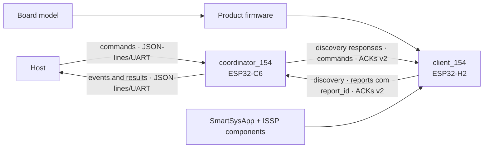

# EKOM — Mapa da Fonte Única da Verdade

**Classe da fonte:** Normativa

**Estado da fonte:** Vigente

**Escopo:** Todo o repositório IoTSmartLink15.4

O mapa localiza autoridade, estrutura e relações sem duplicar contratos
detalhados. O índice responde onde está a fonte; a árvore, como o domínio se
organiza; o diagrama, como os alvos separados se conectam.

## 1. Governança

| Área | Fonte | Tipo | Estado |
|---|---|---|---|
| Instruções para agentes | `AGENTS.md` | Normativo | Active; EKOM 4.5 |
| Método e perfis | `/Users/marcelocostamiranda/source/EKM-guidelines` | Normativo externo | EKOM 4.5 vigente |
| Diretriz local | `docs/rfc/EKOM-GUIDELINES.md` | Normativo local | Active |
| Mapa | `docs/rfc/KNOWLEDGE-MAP.md` | Normativo | Active |
| Histórico EKOM | `docs/rfc/EKOM-CHANGELOG.md` | Operacional | Active |
| Dossiê do sistema | `docs/specs/SYSTEM-DOSSIER.md` | Informativo | Active |
| Decisões arquiteturais | `docs/adr/` | Normativo | ADR-0001 a ADR-0005 Accepted; ADR-0001 com nota de reavaliação de 14/08/2026 |
| Relatórios | `docs/reports/` | Evidência histórica | Roteamento EKOM 4.5 vigente |
| Débitos técnicos | Seção 7 deste mapa | Normativo | `EKOM-DEBT-0001` a `EKOM-DEBT-0005` Accepted |
| Registros EKM 1.x | `docs/history/ekom-1x/` | Histórico | Superseded para novas atuações |

Os arquivos `CLAUDE.md` e `.github/copilot-instructions.md` são adaptadores e
não criam autoridade paralela.

## 2. Índice de domínios e autoridade

| Domínio | Fonte normativa | Estado do workflow | Código principal | Evidência | Cobertura |
|---|---|---|---|---|---|
| Arquitetura ISSP | `docs/specs/ISSP-Architecture.md`; ADR-0001 | Concluída | `components/issp_*` | Builds e hardware históricos | Revisado |
| Commissioning | `docs/specs/ISSP-Commissioning.md` | Concluída | Network manager, transporte e coordenador | Hardware histórico | Revisado |
| Componentes reutilizáveis | `docs/specs/ISSP-Reusable-Components.md`; ADR-0001 | Concluída | `components/issp_*` | Dois consumidores locais | Revisado |
| Bootstrap `SmartSysApp` | `docs/specs/ISSP-Configurable-Bootstrap.md`; ADR-0001 | Concluída para v1.5 | `components/issp_app_154` | Build H2 e hardware históricos; suítes não executadas | Revisado |
| Variantes de firmware | `docs/specs/Firmware-Variants-Menuconfig.md`; ADR-0002 | Concluída | `client_154/main/` | Builds e hardware aprovados; suítes não executadas | Revisado |
| Deep sleep do client | `docs/specs/Client-Deep-Sleep.md`; `docs/specs/ISSP-Configurable-Bootstrap.md`; `docs/specs/ISSP-Reusable-Components.md`; `docs/specs/Firmware-Variants-Menuconfig.md`; ADR-0002 | v0.10 e v0.11 em implementação [`In Progress`] | `components/issp_app_154`; `issp_core`; `issp_behaviors`; `issp_transport_154`; `client_154/main/` | Análises das v0.3 a v0.11 e relatórios de implementação da v0.10 e da v0.11; build canônico H2 da v0.11 executado; suítes não executadas | v0.11 implementada em código; DEEPSLEEP-AC-012 pendente de hardware |
| Identidade de reports | `docs/specs/ISSP-Report-Identity.md`; ADR-0004 | v0.3 Concluída [`Done`] | `components/issp_core`; `issp_transport_154`; `components/issp_app_154`; `coordinator_154/main/report_data_policy.c` | Análise, implementação e revisão v0.3; builds concluídos; comportamento funcional relatado validado em hardware | Implementada e validada; ressalvas diagnósticas, normativas e cenários adversos aceitos como risco residual |
| Registry do coordenador | `docs/specs/ISSP-Coordinator-Paired-Device-Registry.md` | Implementação; validação pendente | `coordinator_154/main/device_registry*` | Build C6; 24 casos não executados | Especificado |
| Targets e testes | `docs/specs/Repository-Test-Execution-Policy.md`; ADR-0003 | Concluída | guards CMake e test apps | 63 casos preservados e não executados; builds H2/C6 | Revisado |
| Consolidação ISSP | `docs/specs/ISSP-Consolidation.md` | Concluída | Client e coordenador | Auditoria e hardware históricos | Revisado |
| Protocolo wire ISSP | `docs/specs/ISSP-Report-Identity.md`; `EKM-GAP-0002` | v2 implementado nos dois codecs; protocolo integral ainda aberto | `issp_protocol.cpp`; `iot154_packet.h` | Vetores dourados host-native em ambos os targets | Cobertura parcial |
| Enlace ACK/retry | `docs/specs/ISSP-Report-Identity.md`; `EKM-GAP-0006` | Identidade v2 concluída; correlação exige `report_id` | Transporte, executor e coordenador | Análises, implementações e revisões v0.2/v0.3; comportamento funcional relatado validado em hardware | Implementado e validado no caminho funcional; cenários adversos da fronteira UART aceitos sem execução própria |
| Nível de bateria do client | `docs/specs/Client-Battery-Level.md` (`EKOM-BATTERY-001`); ADR-0005 | v0.5 Concluída [`Done`]; análise **Pronta** [`Ready`]; ADR-0005 `Accepted` | `components/issp_app_154`; `components/issp_behaviors`; `client_154/main/` | Análise, implementação e revisão v0.5; builds H2 concluídos; testes em hardware executados e aceitos pelo Arquiteto | Implementada, revisada e validada em hardware; riscos residuais e débitos preservados |
| Features configuráveis do client | `docs/specs/Client-SDK-Configurable-Features.md` (`EKOM-CLIENT-CONFIG-001`); ADR-0002 | v0.1 Concluída [`Done`] por decisão do Arquiteto | `client_154/main/`; lifecycle periódico da bateria | Análise `Ready`; implementação recuperada da execução `32091116616`; hierarquia `App Client` validada pelo Arquiteto; builds H2 default, sem deep sleep, sem bateria e alternativo concluídos | Implementada e aceita pelo Arquiteto; testes, flash, monitor e hardware `Not Executed` |
| Identidade de capability | ADR-0005 `Accepted`; `EKOM-DEBT-0001` | Modelo aceito em 14/08/2026; retrofit postergado | `components/issp_app_154`; `client_154/main/firmwares`; `examples/issp_minimal_client` | Nenhuma | Divergente do modelo nas capabilities existentes |
| Protótipo da raiz | `EKM-GAP-0007` | Não mapeado | `main/`; `sdkconfig` | Nenhuma evidência normativa | Inventariado |

## 3. Árvore de conhecimento

```text
IoTSmartLink15.4
├── Runtime targets
│   ├── client_154 — ESP32-H2
│   │   ├── Product firmware
│   │   │   ├── Single smart plug
│   │   │   └── Door sensor battery H2 — door_sensor_battery_h2, com wake_led e dry_contact_wakeup
│   │   ├── Board model
│   │   │   ├── Current client ESP32-H2 wiring
│   │   │   └── Door Sensor Battery H2
│   │   └── SmartSysApp + componentes ISSP compartilhados
│   │       ├── Deep sleep opt-in — timer e wakeup por contato (EXT1) implementados
│   │       ├── Features via menu `App Client` — energia, bateria e GPIO de reset; v0.1 concluída
│   │       ├── Identidade de report gerada no client — v0.3 concluída
│   │       └── Nível de bateria — v0.5 concluída; implementação e hardware aceitos
│   └── coordinator_154 — ESP32-C6
│       ├── commissioning e rádio
│       ├── registry persistente
│       ├── commands, reports e ACKs
│       ├── janela volátil de deduplicação por report_id — v0.3 concluída
│       └── ponte JSON-lines/UART para o host
├── Conexão lógica
│   └── ISSP sobre IEEE 802.15.4
├── Evidência de integração
│   └── examples/issp_minimal_client
├── Conhecimento
│   ├── specs — contratos
│   ├── adr — decisões duráveis
│   ├── reports — execuções e evidências
│   └── rfc — mapa, diretriz local e transações
└── Protótipo não classificado
    └── projeto ESP-IDF da raiz
```

Product firmware define comportamento e capabilities; board model define
recursos e pinagem físicos; componentes compartilhados fornecem capacidades e
plataforma; client e coordenador não compartilham código de aplicação.

## 4. Diagrama de relações



As setas entre os alvos representam protocolo ISSP sobre IEEE 802.15.4, não
dependência de código entre seus diretórios.

## 5. Lacunas

| ID | Estado | Lacuna | Critério de encerramento | Dependência |
|---|---|---|---|---|
| `EKM-GAP-0001` | Closed | Arquitetura removida durante consolidação | Conteúdo restaurado e validado | ISSP Architecture v1.1 |
| `EKM-GAP-0002` | Partial | Layout wire v2 de reports especificado e implementado; contrato wire integral ainda não consolidado em fonte dedicada | Layout, tipos, checksum, endianness e compatibilidade de todo o protocolo validados e consolidados | `ISSP-Report-Identity.md` cobre somente o corte v2 necessário |
| `EKM-GAP-0003` | Open | Matriz estável requisito–evidência incompleta | Matriz vigente e verificável | Recorte próprio |
| `EKM-GAP-0004` | Closed | Contratos e prova de reutilização | Dois consumidores e compatibilidade comprovados | Componentes reutilizáveis |
| `EKM-GAP-0005` | Closed | Destino dos relatórios de validação indefinido | `docs/reports/` e roteamento EKOM 3.2 adotados | Reconciliação EKOM 3.2 concluída |
| `EKM-GAP-0006` | Partial | Identidade e ACK v2 funcionais no caminho principal relatado em hardware; fronteira UART adversa ainda sem evidência | Identidade e ACK v2 repetidos em hardware, com fronteira UART adversa observada | `ISSP-Report-Identity.md`; ADR-0004 |
| `EKM-GAP-0007` | Open | Projeto ESP-IDF da raiz não classificado | Propósito, target e autoridade definidos ou projeto retirado | Decisão arquitetural futura |

Uma lacuna registrada não autoriza preenchimento por suposição.

## 6. Manutenção

**Namespace de transações, lacunas e débitos:** `EKOM-CHG`, `EKOM-GAP` e
`EKOM-DEBT` vigentes | `EKM-CHG` e `EKM-GAP` legados

Débitos técnicos aceitos ficam na seção 7 e seguem a `ADR-0013` do EKOM externo.
Lacuna é conhecimento ausente; débito é correção conscientemente postergada.
Nenhum agente aceita débito, quitação ou substituição por autoridade própria.

Atualize este mapa quando autoridade, responsabilidade, relação material,
estado, evidência ou lacuna mudar. Reconcilie a árvore quando composição ou
responsabilidade mudar e o diagrama quando a conexão entre alvos mudar.

Somente o Arquiteto determina Concluída ou Reaberta. Não remova uma entrada sem
indicar o destino do conhecimento correspondente.

## 7. Débitos técnicos

Registro canônico dos débitos aceitos, conforme a `ADR-0013` do EKOM 4.4. A
aceitação registra a postergação consciente; **não** torna conforme o que está
em desconformidade nem altera evidência.

| ID | Estado | Condição | Alcance |
|---|---|---|---|
| `EKOM-DEBT-0001` | Aceito [`Accepted`] | Capabilities existentes recebem `eventType` do product firmware, contrariando o modelo em que o tipo é a natureza da capability; a unicidade contratada é do par, e não do endpoint | Fachada `SmartSysApp`; `single_smart_plug`; `door_sensor_battery_h2`; `examples/issp_minimal_client`; `smart_sys_app_test` |
| `EKOM-DEBT-0002` | Aceito [`Accepted`] | `ISSP-Configurable-Bootstrap` não aponta para a ADR-0005 que estende sua semântica de endpoint e evento | `docs/specs/ISSP-Configurable-Bootstrap.md` |
| `EKOM-DEBT-0003` | Aceito [`Accepted`] | A tabela de tipos de evento existe em código do coordenador sem guarda que a confronte com a ADR-0005 | `coordinator_154/main/iot154_packet.h`; `type_from_event`; `value_from_event` |
| `EKOM-DEBT-0004` | Aceito [`Accepted`] | O host não distingue capability de bateria ausente por falha de configuração do ADC, nem valor calibrado de valor aproximado no modo degradado | `EKOM-BATTERY-001`; coordenador; contrato host |
| `EKOM-DEBT-0005` | Aceito [`Accepted`] | O `client_154/sdkconfig` rastreado seleciona o sensor de porta e seu board, divergindo dos defaults do Kconfig e da baseline documentada pela decisão A9 | `client_154/sdkconfig`; `docs/specs/Firmware-Variants-Menuconfig.md` |

### `EKOM-DEBT-0001` — identidade de capability nas capabilities existentes

- **Evidência:** `SwitchConfig.eventType` e `DoorSensorConfig.eventType` em
  `components/issp_app_154/include/SmartSysApp.h`; `hasDuplicateEndpoint`
  compara o par em `components/issp_app_154/src/smart_sys_app.cpp`; consumidores
  em `client_154/main/firmwares/` e `examples/issp_minimal_client/main/main.cpp`.
- **Consequência:** um product firmware pode compor um sensor de porta
  declarando o tipo de evento de plug, e nada no sistema detecta; o host receberia
  rótulo incorreto. Duas capabilities podem ainda compartilhar endpoint com
  eventos distintos.
- **Postergação:** aceita pelo Arquiteto em 14/08/2026, tratando o retrofit como
  débito em vez de bloquear `EKOM-BATTERY-001`.
- **Critério de quitação:** `eventType` removido das configurações públicas das
  capabilities existentes; tipo injetado pela fachada; unicidade por endpoint
  vigente; firmwares e exemplo migrados; `smart_sys_app_test` reconciliado por
  especificação que o inclua explicitamente no recorte.
- **Gatilho de reavaliação:** introdução de um terceiro produto, de uma segunda
  instância da mesma capability num mesmo firmware, ou observação de rótulo
  incorreto no host.
- **Relações:** ADR-0005; `docs/specs/Client-Battery-Level.md`;
  `docs/specs/ISSP-Configurable-Bootstrap.md`;
  `docs/specs/Firmware-Variants-Menuconfig.md`;
  `docs/specs/ISSP-Reusable-Components.md`, cuja prova de dois consumidores
  depende do exemplo migrado.

### `EKOM-DEBT-0002` — relação normativa não navegável

- **Evidência:** `ISSP-Configurable-Bootstrap.md` afirma que `endpointId` e
  `eventType` permanecem configuráveis e com a semântica atual; a ADR-0005
  declara `Amends` sobre essa semântica, sem que a especificação aponte de volta.
- **Consequência:** quem ler apenas o bootstrap não descobre que sua semântica
  foi estendida, e pode compor produto por uma regra revogada.
- **Postergação:** aceita pelo Arquiteto em 14/08/2026.
- **Critério de quitação:** bootstrap emendado citando a ADR-0005 como origem da
  extensão.
- **Gatilho de reavaliação:** aceitação da ADR-0005, **ocorrida em 14/08/2026**; a remediação não foi autorizada e o débito permanece `Accepted`.
- **Relações:** ADR-0005; `docs/specs/ISSP-Configurable-Bootstrap.md`.

### `EKOM-DEBT-0003` — tabela de tipos de evento sem guarda

- **Evidência:** `IOT154_EVENT_DOOR`, `IOT154_EVENT_POWER` e
  `IOT154_EVENT_BATTERY_LEVEL_PERCENT` em `coordinator_154/main/iot154_packet.h`;
  tradução em `type_from_event` e `value_from_event`, com rótulo genérico
  `"Device"` para tipo não registrado.
- **Consequência:** a ADR-0005 é a única autoridade sobre a tabela, e nada
  impede que o cabeçalho divirja dela; um tipo não registrado passa despercebido
  como capability genérica no host.
- **Postergação:** aceita pelo Arquiteto em 14/08/2026.
- **Critério de quitação:** confronto verificável entre a tabela em código e o
  registro da ADR, por fonte normativa dedicada ou por guarda automática.
- **Gatilho de reavaliação:** alocação de um tipo de evento novo, ou
  encerramento de `EKM-GAP-0002`.
- **Relações:** ADR-0005; `EKM-GAP-0002`.

### `EKOM-DEBT-0004` — observabilidade da telemetria de bateria

- **Evidência:** `BATTERY-016` e o segundo desvio arquitetural de
  `Client-Battery-Level.md` mantêm a capability inerte e observável apenas em log
  local; `BATTERY-015` mantém o modo degradado sem sinalização ao host.
- **Consequência:** o host não distingue dispositivo sem bateria de dispositivo
  com medição defeituosa, nem percentual calibrado de percentual aproximado.
- **Postergação:** aceita pelo Arquiteto em 14/08/2026; os riscos residuais
  correspondentes permanecem declarados na especificação.
- **Critério de quitação:** o host passa a distinguir ambas as condições por
  meio observável, sem valor sentinela que amplie o domínio do evento.
- **Gatilho de reavaliação:** primeiro caso de campo em que a distinção for
  necessária, ou introdução de diagnóstico equivalente no coordenador.
- **Relações:** `docs/specs/Client-Battery-Level.md`; ADR-0005.

### `EKOM-DEBT-0005` — configuração rastreada divergente da baseline declarada

- **Evidência:** `client_154/main/Kconfig.projbuild` mantém `Single smart plug`
  e `Current client ESP32-H2 wiring` como defaults; a decisão A9 de
  `docs/specs/Firmware-Variants-Menuconfig.md` determina a mesma baseline; o
  `client_154/sdkconfig` rastreado seleciona `Door sensor battery H2` e `Door
  Sensor Battery H2`.
- **Consequência:** build que reutilize diretamente o `sdkconfig` rastreado não
  representa a composição default declarada, o que torna ambígua a baseline de
  entrega sem regeneração ou seleção explícita.
- **Postergação:** aceita pelo Arquiteto em 15/08/2026. O arquivo deve permanecer
  como está e sua correção não integra `EKOM-CLIENT-CONFIG-001`.
- **Critério de quitação:** alinhar conscientemente o `sdkconfig` rastreado à
  composição declarada como baseline e registrar a evidência correspondente,
  ou emendar a fonte normativa para declarar outra baseline.
- **Gatilho de reavaliação:** próxima alteração do `sdkconfig` rastreado, dos
  defaults do menu ou da composição usada como baseline de entrega.
- **Relações:** `docs/specs/Firmware-Variants-Menuconfig.md`;
  `docs/specs/Client-SDK-Configurable-Features.md`.
