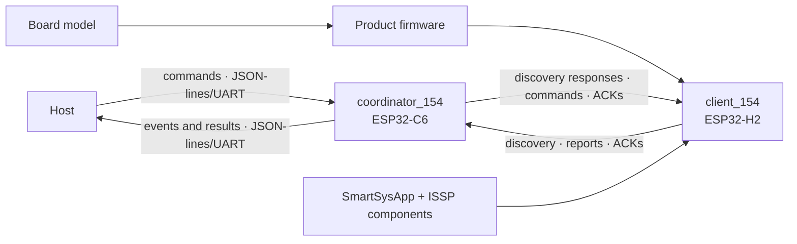

# EKOM — Mapa da Fonte Única da Verdade

**Classe da fonte:** Normativa

**Estado da fonte:** Vigente

**Escopo:** Todo o repositório IoTSmartLink15.4

O mapa localiza autoridade, estrutura e relações sem duplicar contratos
detalhados. O índice responde onde está a fonte; a árvore, como o domínio se
organiza; o diagrama, como os alvos separados se conectam.

## 1. Governança

| Área | Fonte | Tipo | Estado |
|---|---|---|---|
| Instruções para agentes | `AGENTS.md` | Normativo | Active; EKOM 3.2 |
| Método e perfis | `/Users/marcelocostamiranda/source/EKM-guidelines` | Normativo externo | EKOM 3.2 vigente |
| Diretriz local | `docs/rfc/EKOM-GUIDELINES.md` | Normativo local | Active |
| Mapa | `docs/rfc/KNOWLEDGE-MAP.md` | Normativo | Active |
| Histórico EKOM | `docs/rfc/EKOM-CHANGELOG.md` | Operacional | Active |
| Dossiê do sistema | `docs/specs/SYSTEM-DOSSIER.md` | Informativo | Active |
| Decisões arquiteturais | `docs/adr/` | Normativo | ADR-0001 a ADR-0003 Accepted |
| Relatórios | `docs/reports/` | Evidência histórica | Roteamento EKOM 3.2 vigente |
| Registros EKM 1.x | `docs/history/ekom-1x/` | Histórico | Superseded para novas atuações |

Os arquivos `CLAUDE.md` e `.github/copilot-instructions.md` são adaptadores e
não criam autoridade paralela.

## 2. Índice de domínios e autoridade

| Domínio | Fonte normativa | Estado do workflow | Código principal | Evidência | Cobertura |
|---|---|---|---|---|---|
| Arquitetura ISSP | `docs/specs/ISSP-Architecture.md`; ADR-0001 | Concluída | `components/issp_*` | Builds e hardware históricos | Revisado |
| Commissioning | `docs/specs/ISSP-Commissioning.md` | Concluída | Network manager, transporte e coordenador | Hardware histórico | Revisado |
| Componentes reutilizáveis | `docs/specs/ISSP-Reusable-Components.md`; ADR-0001 | Concluída | `components/issp_*` | Dois consumidores locais | Revisado |
| Bootstrap `SmartSysApp` | `docs/specs/ISSP-Configurable-Bootstrap.md`; ADR-0001 | Concluída para v1.5 | `components/issp_app_154` | Build H2 e hardware históricos; suítes não executadas | Revisado |
| Variantes de firmware | `docs/specs/Firmware-Variants-Menuconfig.md`; ADR-0002 | Concluída | `client_154/main/` | Builds e hardware aprovados; suítes não executadas | Revisado |
| Deep sleep do client | `docs/specs/Client-Deep-Sleep.md`; `docs/specs/ISSP-Configurable-Bootstrap.md`; `docs/specs/ISSP-Reusable-Components.md`; `docs/specs/Firmware-Variants-Menuconfig.md`; ADR-0002 | Proposta; v0.10 em implementação | `components/issp_app_154`; `issp_core`; `issp_behaviors`; `issp_transport_154`; `client_154/main/` | Análises das v0.3 a v0.10 e relatório de implementação; builds, testes e hardware não executados | Implementado sem verificação |
| Registry do coordenador | `docs/specs/ISSP-Coordinator-Paired-Device-Registry.md` | Implementação; validação pendente | `coordinator_154/main/device_registry*` | Build C6; 24 casos não executados | Especificado |
| Targets e testes | `docs/specs/Repository-Test-Execution-Policy.md`; ADR-0003 | Concluída | guards CMake e test apps | 63 casos preservados e não executados; builds H2/C6 | Revisado |
| Consolidação ISSP | `docs/specs/ISSP-Consolidation.md` | Concluída | Client e coordenador | Auditoria e hardware históricos | Revisado |
| Protocolo wire ISSP | `EKM-GAP-0002` | Rascunho e análise | `issp_protocol.cpp`; `iot154_packet.h` | Implementações separadas | Inventariado |
| Enlace ACK/retry | `EKM-GAP-0006` | Rascunho e análise | Transporte, executor e coordenador | Limitação observada em hardware | Inventariado |
| Protótipo da raiz | `EKM-GAP-0007` | Não mapeado | `main/`; `sdkconfig` | Nenhuma evidência normativa | Inventariado |

## 3. Árvore de conhecimento

```text
IoTSmartLink15.4
├── Runtime targets
│   ├── client_154 — ESP32-H2
│   │   ├── Product firmware
│   │   │   ├── Single smart plug
│   │   │   └── Door sensor battery H2 — door_sensor_battery_h2, com wake_led
│   │   ├── Board model
│   │   │   ├── Current client ESP32-H2 wiring
│   │   │   └── Door Sensor Battery H2
│   │   └── SmartSysApp + componentes ISSP compartilhados
│   │       └── Deep sleep opt-in — especificado e implementado, sem build ou validação
│   └── coordinator_154 — ESP32-C6
│       ├── commissioning e rádio
│       ├── registry persistente
│       ├── commands, reports e ACKs
│       └── ponte JSON-lines/UART para o host
├── Conexão lógica
│   └── ISSP sobre IEEE 802.15.4
├── Evidência de integração
│   └── examples/issp_minimal_client
├── Conhecimento
│   ├── specs — contratos
│   ├── adr — decisões duráveis
│   ├── reports — execuções e evidências
│   └── rfc — mapa, diretriz local e transações
└── Protótipo não classificado
    └── projeto ESP-IDF da raiz
```

Product firmware define comportamento e capabilities; board model define
recursos e pinagem físicos; componentes compartilhados fornecem capacidades e
plataforma; client e coordenador não compartilham código de aplicação.

## 4. Diagrama de relações



As setas entre os alvos representam protocolo ISSP sobre IEEE 802.15.4, não
dependência de código entre seus diretórios.

## 5. Lacunas

| ID | Estado | Lacuna | Critério de encerramento | Dependência |
|---|---|---|---|---|
| `EKM-GAP-0001` | Closed | Arquitetura removida durante consolidação | Conteúdo restaurado e validado | ISSP Architecture v1.1 |
| `EKM-GAP-0002` | Open | Especificação wire ISSP dedicada ausente | Layout, tipos, checksum, endianness e compatibilidade validados | Recorte próprio |
| `EKM-GAP-0003` | Open | Matriz estável requisito–evidência incompleta | Matriz vigente e verificável | Recorte próprio |
| `EKM-GAP-0004` | Closed | Contratos e prova de reutilização | Dois consumidores e compatibilidade comprovados | Componentes reutilizáveis |
| `EKM-GAP-0005` | Closed | Destino dos relatórios de validação indefinido | `docs/reports/` e roteamento EKOM 3.2 adotados | Reconciliação EKOM 3.2 concluída |
| `EKM-GAP-0006` | Open | Enlace confirmado sujeito a timeout/retry espúrio | Identidade e ACK confiáveis repetidos em hardware | Especificação própria |
| `EKM-GAP-0007` | Open | Projeto ESP-IDF da raiz não classificado | Propósito, target e autoridade definidos ou projeto retirado | Decisão arquitetural futura |

Uma lacuna registrada não autoriza preenchimento por suposição.

## 6. Manutenção

**Namespace de transações e lacunas:** `EKOM` vigente | `EKM` legado

Atualize este mapa quando autoridade, responsabilidade, relação material,
estado, evidência ou lacuna mudar. Reconcilie a árvore quando composição ou
responsabilidade mudar e o diagrama quando a conexão entre alvos mudar.

Somente o Arquiteto determina Concluída ou Reaberta. Não remova uma entrada sem
indicar o destino do conhecimento correspondente.
