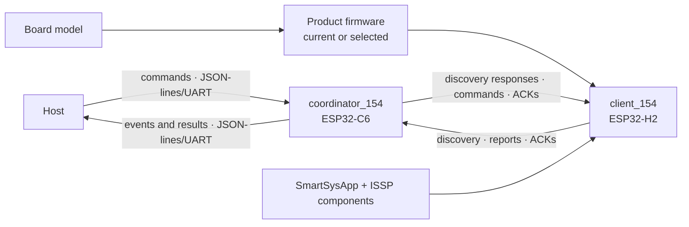

# EKM — Mapa das Fontes de Verdade

**Tipo:** Normativo
**Status:** Active
**Versão:** 1.14
**Responsável:** Marcelo Miranda
**Última atualização:** 05/08/2026
**Escopo:** Todo o repositório

---

## 1. Objetivo

Indicar onde está o conhecimento autoritativo de cada área do projeto e como
localizar sua implementação e suas evidências.

Este mapa não duplica contratos detalhados das fontes. Ele aponta para elas,
registra sua classificação e estado e mantém as visões compactas necessárias
para navegar pelas fronteiras do sistema.

---

## 2. Governança do repositório

| Área | Fonte | Tipo | Estado |
|---|---|---|---|
| Instruções para assistentes | `AGENTS.md` | Normativo | Active |
| Diretrizes EKM | `docs/rfc/EKM-GUIDELINES.md` | Normativo | Active v1.3; ciclo de vida das especificações definido em `EKM-CHG-0006` |
| Mapa de conhecimento | `docs/rfc/KNOWLEDGE-MAP.md` | Normativo | Active |
| Histórico de mudanças EKM | `docs/rfc/EKM-CHANGELOG.md` | Operacional | Active |
| Manual da IA Executora | `docs/rfc/MAN-0001.md` | Normativo complementar | Active |
| Instruções do Copilot | `.github/copilot-instructions.md` | Adaptador | Active |

Os arquivos de instrução de ferramentas são adaptadores. Em caso de diferença,
`EKM-GUIDELINES.md` é a fonte canônica das regras EKM.

---

## 3. Especificações ISSP e IEEE 802.15.4

| Área | Fonte normativa | Estado normativo | Estado da implementação | Implementação principal | Evidência atual |
|---|---|---|---|---|---|
| Arquitetura ISSP | `docs/specs/ISSP-Architecture.md` | Active | Validated | `components/issp_*` e a composição do client em `client_154/main/` | Builds, hardware, consumidor mínimo e auditoria documental |
| Commissioning | `docs/specs/ISSP-Commissioning.md` | Active | Validated | `Issp154NetworkManager`, transporte e coordenador | Cenários da especificação e testes em hardware |
| Consolidação | `docs/specs/ISSP-Consolidation.md` | Active | Validated | Client e coordenador | Relatório de execução e auditoria posterior |
| Componentes reutilizáveis | `docs/specs/ISSP-Reusable-Components.md` | Active | Validated | `components/issp_*` | Dois consumidores compilando e equivalência do worktree comprovada |
| API `SmartSysApp` e bootstrap configurável | `docs/specs/ISSP-Configurable-Bootstrap.md` | Active | Validated | `components/issp_app_154`; `client_154/main/` (composição hoje em `firmwares/single_smart_plug.cpp`) e `examples/issp_minimal_client` migrados | Quatro builds sem warnings; 19/19 testes QEMU; validação e aceite humanos em hardware; risco de ACK/retry separado em `EKM-GAP-0006` |
| Variantes de firmware por `menuconfig` | `docs/specs/Firmware-Variants-Menuconfig.md` | Proposed; revisão vigente `Implementable` | In Progress; Fase 1 com implementação concluída | Fase 1 implementada em `client_154/main/`: `Kconfig.projbuild`, `CMakeLists.txt` de seleção, `app_main.cpp`, `product_firmware.hpp`, `firmwares/single_smart_plug.cpp` e `boards/current_client_esp32h2_wiring.cpp`; componentes `issp_*` inalterados; Fase 2 e segunda composição pendentes | Quatro builds sem warnings; 20/20 testes QEMU; seleção comprovada em `compile_commands.json`; caso negativo ESP32-C6 falha na configuração; validação em hardware ESP32-H2 executada e aceita pelo Arquiteto |
| Protocolo wire ISSP | Especificação dedicada ainda inexistente | — | Blocked | Client em `components/issp_core/src/issp_protocol.cpp`; coordenador em `coordinator_154/main/iot154_packet.h` | Lacuna `EKM-GAP-0002` |
| Factory reset | Requisitos distribuídos em commissioning e arquitetura | Active | Validated | `components/issp_app_154/{include,src}/reset/` (realocado de `client_154/main/reset/` por `EKM-CHG-0007`, sem mudança funcional) | Pressão por 10 segundos e redescoberta em hardware |
| Fluxo de comandos | `docs/specs/ISSP-Architecture.md` | Active | Validated | `IsspDevice`, behavior e coordenador | ON/OFF/TOGGLE funcionais; confiabilidade residual de ACK em `EKM-GAP-0006` |
| Reports confirmados | `docs/specs/ISSP-Architecture.md` | Active | Validated | `IsspDevice`, executor e coordenador | Report inicial funcional; turnaround, confirmação e sequência entre retries em `EKM-GAP-0006` |

### 3.1 Visão do repositório e conexão entre os alvos

Esta árvore descreve o estado observado do repositório. O marcador `[proposto]`
identifica o que ainda não está implementado; os demais ramos descrevem
responsabilidades e fontes existentes.

```text
IoTSmartLink15.4 repository
├── Runtime targets
│   ├── client_154 (client IEEE 802.15.4; ESP32-H2 validado)
│   │   ├── app_main.cpp (entrypoint mínimo, sem regra de produto)
│   │   ├── SmartSysApp e componentes ISSP compartilhados
│   │   └── seleção de produto e board (menu IoTSmartLink15.4)
│   │       ├── Product firmware (uma escolha) — main/firmwares/
│   │       │   ├── Single smart plug (implementado; baseline)
│   │       │   ├── [proposto] Dual smart plug + light
│   │       │   ├── [proposto] Door sensor
│   │       │   └── [proposto] Motion sensor
│   │       ├── Board model (uma escolha) — main/boards/
│   │       │   └── Current client ESP32-H2 wiring (implementado)
│   │       └── IDF_TARGET (definido pelo fluxo ESP-IDF)
│   └── coordinator_154 (coordenador IEEE 802.15.4; ESP32-C6 validado)
│       ├── janela de ingresso e resposta a discovery
│       ├── recepção de reports e envio de ACKs
│       ├── envio de comandos e tratamento de retries/ACKs
│       └── ponte host por JSON-lines sobre UART
├── Protocol connection
│   ├── ISSP payload e tipos de mensagem
│   ├── IEEE 802.15.4 frames e endereçamento
│   ├── client: components/issp_core e issp_transport_154
│   ├── coordinator: coordinator_154/main/iot154_packet.h e iot154_radio.*
│   └── lacuna: especificação wire dedicada ainda inexistente
├── Shared client platform
│   ├── issp_app_154 / SmartSysApp
│   ├── issp_behaviors
│   ├── issp_core
│   └── issp_transport_154
├── Integration evidence
│   └── examples/issp_minimal_client
├── Knowledge and governance
│   ├── docs/specs
│   ├── docs/rfc
│   └── AGENTS.md
├── Project automation
│   └── .github (instruções e criação manual do projeto Kanban)
└── Unclassified prototype
    └── root ESP-IDF project
        ├── main/: leitura de bateria e blink
        └── README/testes: ainda descrevem o exemplo hello_world
```

O `client_154` e o `coordinator_154` são alvos fisicamente separados, mas formam
um único fluxo lógico. O host envia comandos ao coordenador; o coordenador os
traduz para ISSP sobre IEEE 802.15.4; o client executa a capability e responde;
reports percorrem o caminho inverso. Discovery e ACKs sustentam a formação e a
confiabilidade desse vínculo.



As setas entre os alvos representam o protocolo ISSP sobre IEEE 802.15.4, não
uma dependência de código entre seus diretórios. Hoje o contrato lógico aparece
em implementações separadas nos dois alvos; `EKM-GAP-0002` registra a ausência
de uma especificação wire dedicada.

Para navegar dentro do ramo de variantes do client: diferença de composição
pertence ao product firmware; diferença física pertence ao board model;
capacidade usada por mais de um produto pertence a um componente; protocolo e
infraestrutura pertencem à plataforma compartilhada. O contrato está em
`docs/specs/Firmware-Variants-Menuconfig.md`.

---

## 4. Documentos históricos e do método

| Documento | Tipo | Autoridade atual |
|---|---|---|
| `client_154/docs/ai-assisted-engineering/PILOT-ISSP.md` | Histórico/experimental | Registra o piloto; não substitui especificações técnicas |
| `docs/rfc/MAN-0001.md` | Normativo complementar | Consultar antes de alterar o método correspondente |

Documentos históricos não devem ser atualizados para simular que decisões
passadas já refletiam o estado atual.

---

## 5. Lacunas conhecidas de conhecimento

| ID | Estado | Lacuna | Critério de encerramento | Evidência ou dependência |
|---|---|---|---|---|
| `EKM-GAP-0001` | `Closed` | Restaurar as decisões vigentes removidas de `ISSP-Architecture.md` durante a consolidação | Conteúdo restaurado, validado contra implementação e mapa atualizado | `ISSP-Architecture.md` v1.1 e `EKM-CHG-0002` |
| `EKM-GAP-0002` | `Open` | Criar especificação dedicada do protocolo wire ISSP | Layout, tipos, checksum, endianness e compatibilidade definidos e validados | Requer recorte próprio |
| `EKM-GAP-0003` | `Open` | Mapear requisitos estáveis para testes automatizados e de hardware | Matriz requisito–evidência vigente | Requer recorte próprio |
| `EKM-GAP-0004` | `Closed` | Registrar contratos públicos, provar reutilização local e comprovar preservação do worktree inicial | APIs, dependências e compatibilidade documentadas; segundo consumidor compilando; cinco alterações preexistentes recuperadas e equivalência comprovada contra o worktree inicial | `ISSP-Reusable-Components.md`, `components/README.md` e `EKM-CHG-0004` |
| `EKM-GAP-0005` | `Open` | Definir preservação dos relatórios de validação relevantes | Localização, retenção e autoridade definidas | Requer decisão operacional |
| `EKM-GAP-0006` | `Open` | Tornar confiável o enlace confirmado entre client e coordenador | Estado explícito `TX → RX pronto`; resultado do comando coerente com a atuação; ACKs confirmados sem timeout espúrio; mesma identidade lógica preservada entre retries; cenário repetido em hardware sem eventos duplicados para o host | Evidência observada no fechamento de `EKM-CHG-0007`; requer especificação própria de transporte/ACK |

Uma lacuna registrada não autoriza o assistente a preenchê-la por suposição.

---

## 6. Regra de manutenção

Atualizar este mapa quando:

- uma nova fonte normativa for criada;
- um documento for substituído, arquivado ou mudar de autoridade;
- um componente assumir ou perder responsabilidade;
- uma nova evidência se tornar obrigatória;
- uma lacuna de conhecimento for identificada ou encerrada.
- uma mudança EKM alterar o estado ou a autoridade de uma fonte.
- uma especificação mudar de estado normativo ou de estado da implementação.

Não remover uma entrada sem indicar o destino do conhecimento correspondente.
