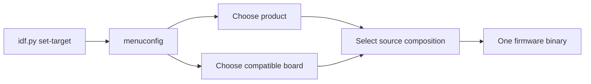

# Variantes de firmware selecionáveis pelo `menuconfig`

**Estado normativo:** Proposed
**Estado da implementação:** In Progress
**Revisão de implementabilidade:** Implementable para a direção integral por
decisão do Arquiteto; B1 a B4 e C1 a C3 foram resolvidos e as decisões 20 a 31
foram confrontadas com o repositório, sem bloqueador remanescente
**Prontidão:** Ready — o Arquiteto considerou o confronto suficiente, resolveu
C1 a C3 e autorizou a implementação da Fase 2

## Missão

Permitir que um único projeto ESP-IDF produza firmwares de produtos diferentes,
selecionados no SDK Configuration Editor, sem copiar o runtime ISSP e sem
espalhar condicionais de produto pelos componentes compartilhados.

Esta mudança deve usar o experimento como prova prática da EKOM: o mapa e a
árvore de conhecimento precisam fornecer contexto suficiente para orientar a
implementação e a evolução de uma variante sem exigir redescobrir a arquitetura
do repositório.

## Resultado que buscamos

- acelerar a localização dos pontos corretos para criar ou alterar um produto;
- aumentar a qualidade mantendo produto, hardware e plataforma em fronteiras
  explícitas;
- aumentar a confiança de que uma nova variante não altera protocolo,
  commissioning ou outro produto por acidente;
- produzir um binário com uma única composição de produto e placa;
- tornar visível por que cada arquivo existe e qual direção de dependência é
  permitida.

## Pergunta central de contexto

> Para adicionar ou modificar uma variante de produto, onde devo atuar e o que
> devo preservar para não acoplar regras do produto à plataforma compartilhada?

A resposta começa na visão de domínio de `docs/rfc/KNOWLEDGE-MAP.md` e é
completada por esta especificação: escolha em `Kconfig`, composição no product
firmware, detalhes elétricos no board model, capabilities em componentes
reutilizáveis e runtime comum em `SmartSysApp`/`issp_*`.

## Estado atual observado

> Esta seção descreve o baseline anterior à Fase 1, usado pela análise de
> implementabilidade. O estado vigente está em “Resultado da implementação da
> Fase 1”.

Antes da Fase 1, `client_154/main/main.cpp` concentrava o entrypoint e a
composição do único produto existente. Ele definia a identidade do dispositivo,
GPIO do relé, GPIO e tempos do factory reset, endpoint e tipo de evento;
registrava uma capability de tomada e iniciava `SmartSysApp`.

`components/issp_app_154` já fornece a fachada compartilhada `SmartSysApp` e
compõe internamente core, behavior, transporte, commissioning, reports e reset.
Os componentes `issp_core`, `issp_transport_154` e `issp_behaviors` já possuíam
fronteiras CMake e contratos públicos. Não existia `Kconfig.projbuild` no
`client_154`, catálogo de boards ou pasta de variantes.

Esse estado forneceu um bom ponto de corte: a mudança extraiu de `main.cpp`
somente a composição específica do produto; não reabriu a arquitetura interna
validada de `SmartSysApp` ou dos componentes ISSP.

## Escopo

- uma seção `IoTSmartLink15.4` no `menuconfig`;
- escolha exclusiva de um product firmware;
- escolha exclusiva de um board model compatível;
- composição em build somente da variante e do board escolhidos;
- entrypoint mínimo, sem regras de produto;
- módulos separados para product firmwares e definições de board;
- uso das operações vigentes e extensão aditiva de `SmartSysApp` somente para
  a capability concreta da Fase 2;
- compatibilidade explícita entre product firmware, board model e
  `IDF_TARGET`;
- primeira migração do produto atual de tomada simples como prova de
  preservação;
- segunda variante `Door sensor` e segundo board ESP32-H2 como prova de
  evolução da composição e da compatibilidade por recursos físicos;
- espaço arquitetural para tomada dupla + luz e sensor de presença, sem
  incluí-los nesta entrega.

### Fase 1 — recorte funcional inicial

A primeira implementação funcional contém somente:

- product firmware `Single smart plug`, selecionado por padrão;
- board model descritivo `Current client ESP32-H2 wiring`, selecionado por
  padrão e compatível exclusivamente com `IDF_TARGET=esp32h2`;
- migração da composição atual para as novas fronteiras, sem alterar a
  plataforma compartilhada.

ESP32-C6 não é target suportado desse board nesta fase. Configurar esse board
com `IDF_TARGET=esp32c6` deve falhar com diagnóstico explícito da
incompatibilidade, antes de produzir um firmware utilizável.

A Fase 1 comprova a seleção, as fronteiras e a preservação do produto atual. Ela
não encerra o experimento de múltiplas variantes: esse encerramento exige uma
segunda composição escolhida pelo Arquiteto e o teste 3 da estratégia EKOM.

### Fase 2 — segunda composição: sensor de porta

A segunda variante é `Door sensor`. A escolha é sustentada por dois fatos do
repositório: o coordenador vigente já interpreta o evento `Door` (`event type
1`) e o histórico do antigo `sensor_154` contém a fiação e o comportamento de
entrada usados como referência. O histórico informa contexto; este recorte é o
contrato vigente.

A Fase 2 contém:

- product firmware `Door sensor`, com device ID `0x15400001`, endpoint 1,
  event type 1, `1 = open`, `0 = closed` e report inicial habilitado;
- board model descritivo `Historical door sensor ESP32-H2 wiring`, compatível
  somente com `IDF_TARGET=esp32h2`;
- entrada de contato seco no GPIO 14, pull-up interno e estado lógico ativo em
  nível alto, e botão de usuário no GPIO 9, ativo em nível baixo;
- amostragem periódica a cada 10 ms, em janelas não sobrepostas de cinco
  amostras; cada janela é classificada pela maioria de três níveis e o estado é
  confirmado após duas janelas consecutivas com a mesma classificação;
- latência máxima de 150 ms entre a estabilização física da entrada e a
  confirmação da transição pelo behavior; transporte, ACK, retry e observação
  no coordenador não pertencem a esse orçamento;
- report inicial estabilizado e publicado sincronamente por `begin()`, antes de
  iniciar o timer periódico, e um novo report para cada transição estabilizada
  posterior, sem exigir reboot;
- `DigitalInputBehavior` reutilizável em `components/issp_behaviors` e a
  operação pública `SmartSysApp::addDoorSensorCapability()`;
- configuração do sensor contendo pino, polaridade, pull, endpoint, evento,
  report inicial, período de 10 ms e parâmetros de debounce; a variante combina
  os valores do board com suas constantes de produto;
- as mesmas regras de ciclo de vida da fachada vigente: capability adicionada
  antes de `setup()`, par endpoint/evento único entre todas as capabilities e
  falha observável por retorno e `lastConfigurationResult()`;
- ausência de tratamento de comandos pelo sensor de porta: comandos dirigidos
  a esse endpoint/evento são reconhecidos pelo behavior, retornam `Unsupported`
  e não alteram a entrada;
- factory reset pelo botão de usuário, com retenção de 10 segundos e polling de
  20 ms, como no produto vigente;
- seleção e build exclusivos da tomada ou do sensor, nunca dos dois no mesmo
  binário.

O mecanismo de observação usa `esp_timer` periódico dentro do behavior, sem
busy-wait, tarefa ou pilha próprias e sem ativar globalmente
`IDeviceBehavior::poll()`. O product firmware fornece semântica, parâmetros e
composição; o board fornece pino, pull e polaridade elétrica.

O timer usa despacho pela tarefa `esp_timer`, nunca por ISR. O behavior é dono
do handle e deve parar e excluir o timer no destrutor e em qualquer caminho de
falha posterior à sua criação, impedindo callback sobre objeto destruído ou
publicação sem publisher válido.

Bateria, ADC, deep sleep, wake-up por GPIO e métricas de consumo existentes no
histórico não pertencem a esta Fase 2. A retomada desses comportamentos exige
recorte próprio para não confundir a prova de variantes com a reconstrução do
produto de baixo consumo.

## Fora de escopo

- implementar qualquer variante nesta etapa de especificação;
- alterar protocolo wire, transporte, commissioning, ACK, retry, formato ou
  pipeline de reports, NVS ou o comportamento interno do factory reset; a Fase
  2 apenas compõe o serviço vigente com os parâmetros já validados;
- selecionar ou mudar o chip alvo do ESP-IDF pelo `menuconfig`;
- tornar componentes conscientes de produto ou placa;
- carregar duas variantes no mesmo binário ou selecionar produto em runtime;
- criar geração de código, sistema próprio de plugins ou framework genérico de
  boards;
- definir nomes comerciais de placas que ainda não estejam confirmados;
- alterar o coordenador, publicar firmware, fazer deploy ou merge na `main`;
- restaurar bateria, ADC, deep sleep, wake-up por GPIO ou métricas do antigo
  `sensor_154`.

## Conceitos e fronteiras

| Conceito | Responsabilidade | Conhece | Não conhece |
|---|---|---|---|
| Plataforma compartilhada | ciclo de vida da aplicação, ISSP, transporte, commissioning, reports, persistência e reset | contratos técnicos e infraestrutura | modelo comercial, combinação de features ou pinagem de um produto |
| Componente reutilizável | uma capability ou behavior isolado e configurável, como saída ou entrada digital | seu contrato, configuração e abstrações da plataforma | qual produto o usa e qual opção do `menuconfig` o selecionou |
| Product firmware / variant | identidade e composição de capabilities e serviços que definem um produto | APIs públicas, contrato do board e regras do próprio produto | detalhes privados do ISSP, rádio ou outra variante |
| Board model | pinagem, polaridade, recursos físicos e compatibilidade com o chip alvo | propriedades elétricas da placa | protocolo, regras do produto e fluxo do `menuconfig` |
| Seleção de build | escolhe exatamente uma composição válida e informa o CMake | símbolos de variante, board e `IDF_TARGET` | estado em runtime ou lógica interna dos componentes |

`ESP32-H2` e `ESP32-C6` são targets/chips, não nomes suficientes de board
model. Um board model deve representar uma placa concreta e declarar com qual
target é compatível. Até os nomes reais serem confirmados, a implementação deve
usar um identificador descritivo para a fiação atual do client, sem inventar um
nome comercial.

Para a Fase 1, o identificador descritivo representa a fiação vigente do
`client_154` e declara somente ESP32-H2 como target compatível. Suporte futuro
ao ESP32-C6 requer board model próprio ou ampliação explícita da compatibilidade,
acompanhada de validação correspondente.

## Visão do domínio

A árvore do repositório, o diagrama que conecta client e coordenador e o ramo
proposto de variantes estão em `docs/rfc/KNOWLEDGE-MAP.md`. Esse mapa é a porta
de entrada para localizar o client dentro do sistema e navegar por suas
responsabilidades; esta especificação permanece responsável pelo comportamento
da seleção, pelas decisões, restrições e critérios de aceite.

## Fluxo de seleção



O `menuconfig` não muda `IDF_TARGET`. Ele apenas impede ou rejeita combinações
incompatíveis com o target já configurado pelo ESP-IDF.

## Decisões e restrições arquiteturais

1. `Kconfig` escolhe a composição do build; ele não controla lógica interna de
   componentes. Símbolos `CONFIG_*` não devem aparecer em `components/issp_*`.
2. Cada build contém exatamente um product firmware e um board model.
3. O CMake traduz a escolha em um conjunto de fontes. Não se compila todas as
   variantes para decidir em runtime.
4. Condicionais de seleção ficam concentradas em `Kconfig.projbuild` e no
   `CMakeLists.txt` do componente `main`. Não se permite uma árvore de `#ifdef`
   dentro de classes de produto ou componentes.
5. `app_main()` apenas obtém a composição selecionada, inicia a aplicação e
   registra o resultado; identidade, capabilities e regras do produto ficam na
   variante.
6. O product firmware recebe uma definição de board por contrato, sem usar
   números de GPIO próprios. O board não instancia capabilities nem inicia a
   plataforma.
7. Capabilities comuns continuam configuráveis e reutilizáveis. Uma nova
   capability só entra em `components/` quando tiver contrato próprio e utilidade
   além da composição de uma única variante.
8. A migração da tomada simples deve preservar os valores atuais: device ID
   `0x15400001`, relé no GPIO 13 ativo em nível alto, reset no GPIO 9 ativo em
   nível baixo por 10 segundos com polling de 20 ms, endpoint 1, event type 2,
   estado inicial desligado e report inicial habilitado.
9. A compatibilidade board/target deve falhar na configuração ou no build com
   mensagem clara. Não se aceita binário silenciosamente configurado para a
   placa errada. Na Fase 1, o board atual aceita somente ESP32-H2; ESP32-C6 é o
   caso negativo obrigatório.
10. A primeira implementação deve ser pequena. Abstrações adicionais só serão
    criadas quando uma segunda variante demonstrar a necessidade.
11. A forma interna do contrato de seleção não é uma decisão arquitetural
    antecipada. A implementação deve usar o menor mecanismo local que satisfaça
    o entrypoint mínimo e a seleção pelo CMake, sem criar abstração transversal.
12. A partir da segunda variante ou do segundo board, cada product firmware deve
    declarar os recursos físicos de que depende e cada board model deve declarar
    os recursos que oferece. A seleção de build deve rejeitar combinações
    incompatíveis com diagnóstico claro antes de produzir o binário.
13. A forma atual de `BoardModel` é local e provisória para a Fase 1, não um
    contrato estável. Os campos `relayPin`, `relayActiveHigh`,
    `factoryResetButtonPin` e `factoryResetButtonActiveLow` podem ser
    substituídos na Fase 2, quando a segunda variante revelar o vocabulário de
    recursos físicos necessário; não devem ser generalizados antecipadamente.
14. A direção integral foi promovida a `Implementable` pelo Arquiteto antes de
    a segunda variante ser definida, como variável deliberada do experimento.
    O recorte concreto da Fase 2 agora exige nova análise antes da implementação;
    a promoção anterior não substitui esse confronto.
15. Na Fase 2, produto e board são compatíveis por classes e quantidades de
    recursos físicos. `Single smart plug` exige uma saída digital e um botão de
    usuário; `Door sensor` exige uma entrada para contato seco e um botão de
    usuário. O board atual oferece a saída e o botão; o board histórico do
    sensor oferece a entrada e o botão.
16. Cada ramo de seleção no CMake declara uma lista de recursos exigidos pelo
    produto ou oferecidos pelo board. O CMake calcula os recursos ausentes e
    rejeita a composição quando a diferença não é vazia. O diagnóstico deve
    nomear produto, board e recurso ausente. Essa validação pertence à
    composição do build; não autoriza símbolos `CONFIG_*` dentro dos componentes
    nem tenta extrair metadados do código C++.
17. O vocabulário físico de `BoardModel` passa a distinguir saída digital,
    botão de usuário e entrada de contato seco. Campos orientados ao produto,
    como `relayPin`, expiram nesta fase; a representação C++ concreta deve ser
    a menor que expresse esses recursos sem criar um framework genérico.
18. `DigitalInputBehavior` é genérico quanto a produto e evento. Ele estabiliza
    uma entrada, publica estado inicial e transições e reconhece seu par
    endpoint/evento para responder `Unsupported` a comandos. A fachada dá a
    semântica pública de sensor de porta; o behavior não conhece `menuconfig`,
    board ou nome de produto.
19. O protocolo wire e o coordenador não mudam: `event type 1` e os valores
    aberto/fechado já são compreendidos pelo alvo coordenador.
20. O debounce da Fase 2 não reivindica equivalência temporal ao código
    histórico. Preserva a votação por cinco amostras e maioria de três, agora
    com período normativo de 10 ms, janelas não sobrepostas, duas classificações
    consecutivas iguais e latência máxima observável de 150 ms.
21. `DigitalInputBehavior` usa um `esp_timer` periódico para observar a entrada.
    A callback deve ser curta e não bloqueante; não se cria tarefa ou pilha por
    behavior e `IDeviceBehavior::poll()` permanece fora deste recorte.
22. `IsspDevice` passa a garantir segurança entre publicação, reserva e
    conclusão de pending reports com `portMUX_TYPE` interno ou seção crítica
    equivalente. Somente o bookkeeping compartilhado fica protegido; callback,
    notificação, codificação e transporte executam fora da seção crítica. O
    comentário que exige chamadores seriais deve ser atualizado para o novo
    contrato.
23. A preservação de uma variante existente é comportamental. Alterações
    mecânicas necessárias para migrar `single_smart_plug.cpp` ao vocabulário
    físico do board são permitidas, desde que todos os valores da decisão 8 e o
    comportamento observado permaneçam inalterados.
24. `issp_app_154` mantém um registro unificado de behaviors e de pares
    endpoint/evento, independentemente do tipo de capability. `setup()` registra
    esse vetor na ordem de adição e o log de capabilities informa o total de
    capabilities configuradas.
25. `DigitalInputBehavior` pode receber uma fonte de níveis injetável em
    construção reservada a testes, análoga a `SetupHooks`. A configuração
    pública do produto continua usando GPIO real e não expõe essa junção.
26. O CMake permanece como diagnóstico primário de compatibilidade. O contrato
    C++ fornece um acessador por classe de recurso e cada board define somente
    os recursos que oferece, produzindo também falha de ligação se os metadados
    divergirem, sem introduzir geração de código ou framework de boards.
27. O limite de 150 ms termina quando o `DigitalInputBehavior` confirma a
    transição e solicita sua publicação. A chegada ao coordenador é evidência
    funcional separada, sem esse limite, porque inclui fila, transporte, ACK e
    retry.
28. O oráculo normativo do debounce é a sequência de classificações: uma
    oscilação é rejeitada quando não produz duas janelas consecutivas com
    maioria do novo nível. Cinquenta milissegundos são apenas o menor intervalo
    teórico capaz de abranger as seis amostras necessárias em alinhamento
    favorável; não são limiar universal independente da fase de amostragem. Os
    testes controlados devem declarar diretamente os níveis de cada amostra.
29. `begin()` estabiliza e publica o estado inicial de forma síncrona usando o
    mesmo classificador de duas janelas. Somente depois inicia o `esp_timer`
    periódico. A espera inicial pode usar um tick por período de 10 ms com a
    configuração vigente, sem alterar o contrato periódico do timer.
30. `DigitalInputBehavior` é responsável pelo ciclo de vida do `esp_timer`.
    Usa despacho por tarefa, para e exclui o timer no destrutor e desfaz sua
    criação em todo caminho de falha; despacho por ISR não é permitido.
31. A dependência interna de `issp_core` em FreeRTOS é aceita neste recorte. A
    proteção abrange slots, `processingCommand_`,
    `reportNotificationDeferred_`, reserva de sequência e qualquer caminho que
    altere `reportSequence_`, inclusive `publishReport()` enquanto existir.
    Reserva e transição de estado ocorrem atomicamente; codificação, callback,
    notificação e transporte permanecem fora da seção crítica, e falha de
    codificação libera a reserva pelo fluxo normal protegido.

### Registro de conhecimento deste experimento

Por decisão do Arquiteto, este experimento não abre nem atualiza uma transação
`EKM-CHG`. O conhecimento material da implementação deve ser reconciliado de
forma concisa nesta especificação e em `docs/rfc/KNOWLEDGE-MAP.md`; o Git
preserva a linhagem técnica. Essa exceção vale somente para este experimento e
não modifica a governança geral do repositório.

## Experiência proposta no `menuconfig`

```text
IoTSmartLink15.4
├── Product firmware
│   ├── Single smart plug (default)
│   └── Door sensor (Fase 2)
└── Board model
    ├── Current client ESP32-H2 wiring (default)
    └── Historical door sensor ESP32-H2 wiring (Fase 2)
```

Dual smart plug + light e motion sensor permanecem fora do `choice` até
possuírem composição compilável e decisão arquitetural aplicável. O menu não
deve oferecer uma seleção que inevitavelmente falhe por ausência de código.

## Estrutura proposta de arquivos

```text
client_154/
├── CMakeLists.txt
└── main/
    ├── Kconfig.projbuild
    ├── CMakeLists.txt
    ├── app_main.cpp
    ├── product_firmware.hpp
    ├── firmwares/
    │   ├── single_smart_plug.cpp
    │   └── door_sensor.cpp
    └── boards/
        ├── board_model.hpp
        ├── current_client_esp32h2_wiring.cpp
        └── historical_door_sensor_esp32h2_wiring.cpp

components/
├── issp_app_154/
├── issp_behaviors/
│   ├── digital_input_behavior.{hpp,cpp}
│   └── test_apps/digital_input_behavior_test/
├── issp_core/
│   └── test_apps/issp_device_concurrency_test/
└── issp_transport_154/
```

Somente arquivos de variantes e boards realmente suportados devem existir. A
árvore mostra o destino do conhecimento e não autoriza criar stubs vazios.

## Pontos reais do código afetados pela Fase 2

| Ponto atual | Mudança esperada na Fase 2 | Preservação obrigatória |
|---|---|---|
| `client_154/main/Kconfig.projbuild` | adicionar as escolhas de sensor e board histórico | escolha exclusiva e ausência de lógica funcional |
| `client_154/main/CMakeLists.txt` | selecionar as novas fontes e validar requisitos contra recursos oferecidos | uma variante, um board e diagnóstico antes do binário |
| `client_154/main/firmwares/door_sensor.cpp` | compor identidade, endpoint, evento e debounce do sensor | nenhuma pinagem literal ou lógica de transporte |
| `client_154/main/boards/board_model.hpp` | substituir campos orientados ao relé por recursos físicos | preservar a composição da tomada e evitar framework genérico |
| `client_154/main/boards/historical_door_sensor_esp32h2_wiring.cpp` | declarar entrada de contato seco e botão de usuário | nenhuma regra de produto ou protocolo |
| `components/issp_behaviors` | adicionar `DigitalInputBehavior`, dependência explícita de `esp_timer` e ciclo de vida do timer | reutilizável, sem produto, board, `CONFIG_*`, tarefa ou pilha própria |
| `components/issp_app_154` | expor `addDoorSensorCapability()` e unificar o registro interno | não expor tipos privados do ISSP nem mudar as operações vigentes |
| `components/issp_core` | serializar o bookkeeping dos pending reports e assumir dependência interna de FreeRTOS | nenhuma regra de produto; codificação, callbacks, notificações e transporte fora da seção crítica |
| novos `test_apps` de `issp_behaviors` e `issp_core` | provar debounce controlado e integridade concorrente | distinguir comportamento observado de prova de exclusão mútua |
| testes de `issp_app_154` | cobrir adição, registro unificado e regressão | preservar assinatura e ordem do hook vigente |
| `docs/rfc/KNOWLEDGE-MAP.md` | marcar sensor e board como especificados | apontar para este contrato sem duplicá-lo |

## Critérios de aceite

### Seleção e build

- **Dado** um `IDF_TARGET` suportado, **quando** o desenvolvedor abre o SDK
  Configuration Editor, **então** encontra uma seção `IoTSmartLink15.4` com uma
  escolha de product firmware e uma escolha de board model.
- **Dado** o menu de produto com duas ou mais variantes implementadas, **quando**
  uma variante é selecionada a partir da Fase 2, **então** nenhuma segunda
  variante pode permanecer selecionada.
- **Dado** um par produto/board válido, **quando** o projeto é configurado e
  compilado, **então** somente as fontes desse produto e desse board entram no
  binário.
- **Dadas** as combinações `Single smart plug` + board atual e `Door sensor` +
  board histórico, **quando** cada build H2 é configurado, **então** ambas são
  aceitas e as escolhas default continuam sendo a tomada e o board atual.
- **Dado** o board atual da Fase 1 e `IDF_TARGET=esp32c6`, **quando** a
  configuração ou o build é executado, **então** a combinação é impedida com
  diagnóstico claro de que esse board aceita somente ESP32-H2.
- **Dado** um product firmware cujos recursos exigidos não são oferecidos pelo
  board selecionado, **quando** a configuração ou o build é executado a partir
  da Fase 2, **então** a combinação é impedida com diagnóstico que identifica o
  produto, o board e o recurso ausente.

### Fronteiras

- **Dada** uma nova variante, **quando** ela é adicionada, **então** sua
  composição não altera protocolo nem `issp_transport_154`; `issp_core` muda
  somente para garantir publicação concorrente segura e variantes existentes
  admitem adaptações mecânicas sem mudança de comportamento.
- **Dado** o código compartilhado, **quando** ele é inspecionado, **então** não
  há símbolo `CONFIG_*` de seleção de produto ou board em `components/issp_*`.
- **Dado** um product firmware, **quando** sua composição é inspecionada,
  **então** ele usa o contrato do board e não contém GPIO literal.
- **Dado** o entrypoint, **quando** ele é inspecionado, **então** não contém
  pinagem, identidade, endpoints ou lista de capabilities de um produto.

### Preservação do produto atual

- **Dada** a seleção da tomada simples e do board que representa a fiação
  atual, **quando** o firmware inicia, **então** identidade, relé, reset,
  endpoint, evento, estado inicial e report inicial são configurados com os
  mesmos valores do baseline observado.
- **Dada** a migração estrutural, **quando** os testes e builds vigentes são
  executados, **então** as operações vigentes de `SmartSysApp`, o protocolo e o
  comportamento compartilhado permanecem compatíveis; a API muda somente pela
  adição da capability de sensor de porta.

O primeiro cenário exige validação no hardware ESP32-H2. Comparação estática ou
build isolado não substituem a observação do firmware em execução.

### Sensor de porta

- **Dada** a composição `Door sensor` com o board histórico, **quando** o
  firmware inicia com a entrada estabilizada em nível alto, **então** publica
  endpoint 1, evento 1 e valor 1 (`open`).
- **Dada** a mesma composição com a entrada estabilizada em nível baixo,
  **quando** o firmware inicia, **então** publica endpoint 1, evento 1 e valor 0
  (`closed`).
- **Dado** o firmware em execução, **quando** a entrada muda e satisfaz o
  debounce especificado, **então** publica uma vez o novo estado sem reboot e
  o behavior confirma a transição em até 150 ms após a estabilização física; o
  prazo não inclui fila, transporte, ACK, retry ou recepção pelo coordenador.
- **Dada** uma sequência controlada que não produz duas janelas consecutivas
  com maioria do novo nível, **quando** a entrada volta ao estado anterior,
  **então** nenhum novo report é publicado.
- **Dadas** duas janelas consecutivas com ao menos três amostras do novo nível
  em cada uma, **quando** a segunda janela é classificada, **então** a transição
  é confirmada uma única vez.
- **Dado** um estado já publicado, **quando** novas leituras estabilizam no
  mesmo valor, **então** nenhum report duplicado é criado.
- **Dado** um comando para endpoint 1 e evento 1, **quando** ele chega ao sensor
  de porta, **então** o behavior reconhece o par, devolve `Unsupported`, não
  altera a entrada e não cria report de mudança.
- **Dado** o sensor pareado, **quando** o botão de usuário permanece pressionado
  por 10 segundos, **então** o factory reset remove o pareamento e permite novo
  commissioning após reboot.
- **Dadas** publicação de uma transição e transmissão de reports em contextos
  concorrentes, **quando** pending reports são publicados, reservados e
  concluídos, **então** contagem, ordem, geração e conteúdo permanecem íntegros,
  sem report perdido, duplicado ou slot corrompido.
- **Dada** a seleção da tomada com o board do sensor ou do sensor com o board da
  tomada, **quando** o build é configurado, **então** ele falha antes de gerar
  binário e identifica respectivamente os recursos físicos ausentes.

Os três primeiros cenários exigem validação no hardware ESP32-H2. Debounce,
supressão de duplicatas e rejeição de comandos também devem possuir evidência
automatizada com uma fonte de níveis controlável.

### Navegabilidade EKOM

- **Dados** o mapa de conhecimento e esta especificação, **quando** alguém
  recebe a tarefa de adicionar o sensor de porta, **então** consegue identificar
  onde registrar a seleção, onde compor o produto, onde definir a placa e o que
  não deve alterar.
- **Dada** uma dúvida sobre a localização de uma regra, **quando** se aplica a
  regra de navegação da árvore, **então** ela conduz a uma única fronteira
  principal: seleção, product firmware, board, componente ou plataforma.

## Estratégia de validação do experimento EKOM

O experimento será avaliado durante a primeira implementação, não pelo volume
do documento.

1. **Teste de orientação:** entregar a pergunta “como adicionar o sensor de
   porta?” usando somente o mapa e esta especificação. A resposta deve apontar
   os pontos de extensão e as fronteiras preservadas sem varredura ampla do
   repositório.
2. **Teste de mudança controlada:** migrar primeiro a tomada simples. O diff
   deve permanecer concentrado nos pontos reais listados acima e não alterar a
   plataforma compartilhada.
3. **Teste de segunda composição:** implementar o sensor de porta usando o
   product firmware, o board histórico, a capability pública e o behavior
   reutilizável definidos nesta Fase 2. Se isso exigir condicionais internas
   nos componentes, alteração do protocolo ou duplicação de runtime, a
   arquitetura ou o mapa deve voltar ao Arquiteto.
4. **Teste de classificação:** avaliar onde seriam colocados “GPIO da placa”,
   “composição de capabilities do sensor” e “retry do rádio”. A árvore deve
   conduzir respectivamente a board model, product firmware e plataforma.
5. **Teste de seleção:** inspecionar os artefatos de build para confirmar uma
   única variante e um único board, além de executar um caso de incompatibilidade
   board/target.
6. **Teste de preservação:** comparar a composição da tomada simples com os
   valores de baseline e executar o conjunto de validação definido abaixo.

### Conjunto de validação da Fase 1

- `git diff --check` e inspeção do diff contra a tabela de pontos afetados;
- configuração gerada contendo exatamente o product firmware e o board default;
- inspeção de `compile_commands.json` ou `build.ninja` comprovando que somente
  as fontes selecionadas entram no build;
- build do `client_154` para ESP32-H2 com ESP-IDF 6.0.1;
- build de `examples/issp_minimal_client` para ESP32-H2;
- execução da suíte de testes de `SmartSysApp` em QEMU ESP32-C3;
- build de `coordinator_154` para ESP32-C6;
- configuração ou build negativo do board da Fase 1 com target ESP32-C6,
  usando `SDKCONFIG` isolado fora da configuração H2 rastreada e contendo o
  diagnóstico esperado;
- validação no hardware ESP32-H2 de boot até `Running`, report inicial, comandos
  `ON`, `OFF` e `TOGGLE`, pressão de factory reset por 10 segundos, reboot e
  retorno ao commissioning. Essa execução comprova a preservação da migração e
  não declara resolvida a lacuna preexistente de ACK/retry (`EKM-GAP-0006`).

### Conjunto de validação da Fase 2

- `git diff --check` e inspeção contra os pontos afetados desta fase;
- builds H2 isolados das duas combinações válidas, com inspeção das fontes
  selecionadas;
- configuração negativa das duas combinações cruzadas, sem produção de
  binário e com diagnóstico do recurso ausente;
- caso negativo ESP32-C6 para os dois boards, sempre com `SDKCONFIG` isolado;
- testes automatizados do `DigitalInputBehavior`, com fonte de níveis injetável,
  cobrindo período de 10 ms, sequências explícitas por janela, maioria, limite
  de 150 ms na fronteira do behavior, estado inicial síncrono, transição,
  supressão de duplicatas, falha de publicação, destruição com timer ativo e
  comando `Unsupported` reconhecido pelo par;
- testes de concorrência do `IsspDevice` exercitando publicação, reserva e
  conclusão intercaladas e confirmando a integridade dos pending reports; a
  evidência deve distinguir integridade observada da garantia de exclusão
  mútua fornecida pela seção crítica e pela inspeção do código;
- testes da adição de `addDoorSensorCapability()` e regressão integral da suíte
  vigente de `SmartSysApp`;
- build de `examples/issp_minimal_client` e de `coordinator_154`, sem mudança
  funcional nesses consumidores;
- hardware da tomada simples repetindo a preservação da Fase 1;
- hardware do sensor ESP32-H2 comprovando boot até `Running`, report inicial
  aberto e fechado, transições nos dois sentidos sem reboot, ausência de report
  por sequência rejeitada, latência máxima de 150 ms medida até a confirmação
  pelo behavior, factory reset e evento correspondente observado no
  coordenador sem limite de entrega associado ao debounce.

Para cada item, falha, execução não iniciada ou resultado desconhecido não
constitui aprovação. A evidência deve permitir distinguir aprovação, reprovação
e ausência de execução.

O experimento é útil se reduzir a redescoberta, tornar os limites previsíveis e
permitir explicar o diff antes de escrevê-lo. Ele falha se o implementador ainda
precisar vasculhar o repositório para descobrir responsabilidades, se duas
fronteiras disputarem a mesma regra ou se o menu apenas esconder um firmware
monolítico cheio de condicionais.

## Variáveis experimentais para encerrar o experimento

- nome e revisão comerciais do board podem substituir o identificador
  descritivo somente após confirmação do Arquiteto;
- a representação C++ concreta dos recursos continua local à implementação,
  limitada pelo vocabulário e pelo mecanismo de compatibilidade das decisões
  15 a 17 e 26;
- o número de slots reservado ao sensor deve ser o mínimo comprovado pelo build,
  sem ampliar preventivamente `kImplStorageBytes`;
- a implementação deve registrar se a extensão aditiva de `SmartSysApp` e a
  compatibilidade por recursos confirmaram as fronteiras ou revelaram contexto
  ainda ausente no mapa.

Essas variáveis são escolhas locais dentro do recorte agora implementável; não
autorizam ampliar protocolo, targets ou produtos. O experimento permanece
aberto até a Fase 2 produzir evidência e o Arquiteto avaliar seu resultado.

## Resultado desta etapa

O Arquiteto aprovou o sensor de porta como segunda composição. A análise de
implementabilidade confirmou a direção estrutural e identificou B1 a B4. O
Arquiteto resolveu esses bloqueadores e autorizou as mudanças compartilhadas
descritas nas decisões 20 a 26. O Consultor reconciliou as decisões nesta
especificação e no mapa, sem iniciar implementação. Naquele momento, o recorte
ainda requeria confronto focado antes de ser promovido para implementação.

O Arquiteto confirmou o registro documental produzido pelo Consultor e
autorizou seu commit e envio à branch do experimento. Essa confirmação não
representava aprovação da implementação nem substituía o confronto focado da
Fase 2, posteriormente executado.

O confronto focado posterior sustentou as decisões 20 a 26 e não encontrou
bloqueador normativo. O Arquiteto considerou o confronto suficiente, resolveu
C1 a C3 nas decisões 27 a 29, reconheceu as consequências de ciclo de vida,
dependência FreeRTOS e infraestrutura de testes e promoveu a Fase 2 para
`Implementable / Ready`. A promoção autoriza implementação, mas não declara
execução ou validação concluída.

O Arquiteto confirmou este registro e autorizou seu commit e envio à branch do
experimento. A confirmação ratifica C1 a C3 e a promoção de prontidão, sem
declarar a Fase 2 implementada ou validada.

## Decisão vigente de implementabilidade

O Arquiteto mantém a direção integral como `Implementable` e promove a Fase 2
para `Implementable / Ready`. B1 a B4 e C1 a C3 estão normativamente resolvidos;
o Implementador pode iniciar o recorte definido. Isso não altera a conclusão da
Fase 1 nem declara a Fase 2 implementada ou validada.

## Análise de implementabilidade da Fase 2 (Engenheiro Analista)

Confronto do recorte vigente da Fase 2 com o repositório, a arquitetura, os
precedentes e os critérios de aceite. Esta análise não altera implementação, não
promove estado e não declara aprovação; ela informa o Arquiteto.

O recorte passou por três rodadas de confronto. A primeira levantou os
bloqueadores B1 a B4, resolvidos pelo Arquiteto nas decisões 20 a 26. A segunda
verificou essas resoluções e apontou os esclarecimentos C1 a C3, resolvidos nas
decisões 27 a 31. Esta rodada confronta as decisões 27 a 31 e revisa se as
anteriores continuam sustentadas pelo código.

### Recomendação

**Prontidão sustentada.** Nenhum bloqueador normativo remanescente. As decisões
27 a 31 são realizáveis com o repositório vigente e fecham C1 a C3 sem criar
contradição com o que já estava decidido.

Duas observações são materiais para o Implementador e não decorrem de leitura de
contrato, mas do comportamento das APIs envolvidas: a junção de teste autorizada
não é suficiente para o oráculo agora exigido (O1), e a API do `esp_timer` não
oferece barreira contra callback em voo, o que limita o que o teste de destruição
pode provar (O2). Nenhuma das duas impede iniciar; ambas mudam como o código deve
ser escrito e como a evidência deve ser lida.

### Verificação das decisões 27 a 31

**Decisão 27 — o limite de 150 ms termina na confirmação pelo behavior:
sustentada e coerente.**
Retira do orçamento exatamente o que não é governado pelo debounce: o executor
usa `kReportAckTimeoutMs = 50` e `kPendingReportRetryDelayMs = 1000`
(`issp154_report_executor.cpp`), incompatíveis com 150 ms por razões alheias à
entrada. Os critérios e o conjunto de validação foram alinhados.

Resta um problema de **instrumentação**, não de contrato: em hardware não se
conhece o instante da estabilização física, porque o acionamento manual não tem
borda registrável. A medição verificável a partir de log é
`confirmação − primeira amostra divergente`, que subestima a latência real em
até um período. Recomendação: o behavior registrar os dois instantes e a
evidência de hardware ser lida como `confirmação − primeira amostra divergente +
10 ms` para o limite superior. Pela aritmética do esquema, o pior caso é
40 + 50 + 50 = 140 ms, então esse teto de leitura ainda cabe nos 150 ms sem
folga adicional.

**Decisão 28 — o oráculo é a sequência de classificações: sustentada e mais
correta que a formulação anterior.**
A ressalva do Arquiteto está certa: 50 ms é o mínimo teórico em alinhamento
favorável, não limiar universal. Um pulso de 50 ms em fase desfavorável distribui
as amostras entre janelas e não produz duas maiorias consecutivas; o mesmo pulso
em fase favorável produz. Declarar os níveis por amostra é a única formulação
determinística, e os critérios de aceite foram reescritos nesses termos.

Consequência direta em **O1**, abaixo: para declarar níveis por amostra, o teste
precisa também governar *quando* a amostra ocorre.

**Decisão 29 — estabilização síncrona em `begin()`: sustentada.**
`begin()` é chamado por `IsspDevice::start()` dentro do estágio `StartDevice`, na
tarefa do `app_main`, depois de `InitializeNetwork`. Nada em `setup()` tem
timeout, o `ResetButtonMonitor` já foi iniciado em `InitializePlatform` e a
tarefa `issp154_rx` (prioridade `tskIDLE_PRIORITY + 4`) segue rodando, portanto
~100 ms de espera em `begin()` não afetam nenhum caminho vigente. Publicar antes
de iniciar o timer também preserva a ordem que `DigitalOutputBehavior` já usa:
falha de publicação aborta `begin()` e o estágio `StartDevice`, e nesse caminho
nenhum timer terá sido criado.

Uma precaução concreta: a decisão observa que a espera pode usar um tick por
período com a configuração vigente, porque `CONFIG_FREERTOS_HZ=100` faz
10 ms = 1 tick exatamente. A espera deve ser escrita como
`pdMS_TO_TICKS(período)` e nunca como contagem literal de ticks — a forma em
milissegundos permanece correta se `CONFIG_FREERTOS_HZ` mudar, e a forma literal
passa a amostrar 1 ms por engano.

**Decisão 30 — ciclo de vida do `esp_timer`: sustentada, com o limite descrito em
O2.** Despacho por tarefa é o default de
`esp_timer_create_args_t::dispatch_method` e é o único compatível com
`portENTER_CRITICAL` no caminho de publicação, conforme a decisão 31. `stop` e
`delete` no destrutor e o desfazimento em qualquer falha posterior à criação
resolvem o risco levantado na rodada anterior.

**Decisão 31 — escopo da seção crítica: sustentada e agora completa.**
A enumeração cobre o que a rodada anterior identificou: slots,
`processingCommand_`, `reportNotificationDeferred_`, reserva de sequência e todo
caminho que altere `reportSequence_`, incluindo o `publishReport()` que hoje é
código morto. Codificação, callback, notificação e transporte ficam fora, e a
falha de codificação libera a reserva pelo fluxo protegido normal — que é
exatamente `completePendingReport(token, false)`, reentrando na seção; portanto a
seção não pode ser retida nesse ponto nem ser recursiva.

Dois detalhes que a implementação precisa não deixar passar:

- os leitores `const` `peekPendingReport()` e `pendingReportCount()` são chamados
  pela tarefa `issp154_report_tx` a cada iteração de `run()` e leem estado
  multi-campo que passa a ser mutado por um contexto de prioridade mais alta.
  Precisam entrar na seção também, o que exige um lock `mutable`. O precedente
  exato existe: `Issp154Transport` declara
  `mutable portMUX_TYPE ackLock_ = portMUX_INITIALIZER_UNLOCKED;`;
- `normalizePendingReportOrders()` é O(n²) sobre oito slots dentro do
  bookkeeping; em `portENTER_CRITICAL` isso desabilita interrupções pelo trecho
  mais longo de toda a seção. Vale manter medido, sobretudo porque a tarefa
  `esp_timer` passa a preemptar tudo a cada 10 ms.

### Observações materiais para o Implementador

**O1 — a junção de teste autorizada não basta para o oráculo exigido.**
A decisão 25 autoriza “uma fonte de níveis injetável”. A decisão 28 exige que os
testes “declarem diretamente os níveis de cada amostra”. Apenas injetar a leitura
não produz isso: o `esp_timer` continua decidindo *quando* ler, então o teste
disputaria a fase de amostragem com o timer e a sequência observada seria
não determinística — exatamente o defeito que a decisão 28 quer evitar.

Para que a sequência seja declarada, o teste precisa governar o passo de
amostragem, não só o valor lido. A forma mínima é o construtor reservado a testes
expor também o passo — uma operação que executa uma amostra e a classificação
correspondente — de modo que o teste chame `passo(nível)` na ordem desejada, sem
timer ativo. Isso permanece análogo a `SetupHooks`: junção declaradamente não
contratual, fora da configuração pública do produto.

Consequência para o conjunto de validação: o período de 10 ms deixa de ser
exercitado pelos testes de sequência e precisa de um caso próprio, que arme o
timer real e verifique a cadência por `esp_timer_get_time()`. São dois tipos de
teste com propósitos distintos — sequência determinística sem timer, cadência com
timer — e a evidência deve dizer qual comprova o quê.

Recomendação ao Arquiteto: confirmar que o construtor reservado a testes da
decisão 25 pode expor o passo de amostragem além da fonte de níveis. É extensão
da mesma junção, não uma nova fronteira, mas a redação atual fala apenas de
níveis.

**O2 — `esp_timer` não oferece barreira contra callback em voo.**
`esp_timer_stop()` desarma o timer, e `esp_timer_delete()` **não libera o objeto
na hora**: ele reinsere o timer na lista da tarefa com `EVENT_ID_DELETE_TIMER`
para que a memória seja liberada em contexto de tarefa. Nenhuma das duas espera
uma callback que já esteja executando na tarefa `esp_timer`. Como a destruição
ocorre em outra tarefa, existe uma janela — a duração de um corpo de callback —
em que a callback ainda toca o objeto sendo destruído.

Em produção isso é inofensivo: as instâncias vivem em `SmartSysApp::Impl` e nunca
são destruídas. O ponto é o item “destruição com timer ativo” do conjunto de
validação: ele pode provar que `stop` e `delete` são chamados e que **nenhuma
callback posterior ocorre**; ele não pode provar que a janela de callback em voo
foi eliminada, porque a API não oferece o barramento necessário. Duas leituras
possíveis, ambas honestas:

1. registrar a janela residual como limitação conhecida da API, com a mitigação
   de manter a callback curta — coerente com a decisão 21;
2. eliminá-la estruturalmente, dando à callback um contexto de vida estática
   próprio, separado do behavior. Isso é um passo de desenho maior e não está
   autorizado pelo recorte.

A análise recomenda a leitura 1 e que a evidência do teste diga o que
efetivamente comprova, sem converter “nenhuma falha observada” em “janela
eliminada”.

### Riscos e incertezas remanescentes

**R1 — o que os testes de concorrência do `IsspDevice` comprovam.** Já
reconhecido pelo conjunto de validação, que agora exige distinguir integridade
observada da garantia dada pela seção crítica e pela inspeção. Registrado aqui
apenas para a evidência não regredir: intercalação determinística comprova a
máquina de estados; duas tarefas em alvo single-core aumentam a confiança;
nenhuma das duas é prova de exclusão mútua.

**R2 — infraestrutura de teste nova em dois componentes.** A estrutura de
arquivos já prevê `issp_behaviors/test_apps/digital_input_behavior_test/` e
`issp_core/test_apps/issp_device_concurrency_test/`. O único precedente é
`components/issp_app_154/test_apps/smart_sys_app_test` — esp32c3 sob QEMU,
`MINIMAL_BUILD ON`, Unity, e deliberadamente sem tocar GPIO. Decorre disso uma
recomendação concreta: o construtor reservado a testes do
`DigitalInputBehavior` deve **dispensar a configuração de GPIO**, já que a fonte
injetada substitui o pino; caso contrário o teste passa a depender da emulação de
GPIO do QEMU, terreno que nenhuma suíte do repositório exercita hoje.

**R3 — `esp_timer` sob QEMU esp32c3 é fato não confirmado por leitura.** Nenhum
app de teste do repositório usa `esp_timer`. Se o periódico não funcionar no
ambiente emulado, o caso de cadência de O1 migra para hardware; os testes de
sequência, por não dependerem do timer, continuam válidos sob QEMU. Ver E2.

**R4 — dependência de `esp_timer` no CMake de `issp_behaviors`.** O componente
declara hoje apenas `issp_core` e `esp_driver_gpio`, e `esp_timer` não está entre
os requisitos comuns do ESP-IDF — `issp_app_154` precisa listá-lo
explicitamente. A tabela de pontos afetados já registra a dependência.

**R5 — validação de pino na nova capability.** `addSwitchPlugCapability()` exige
`GPIO_IS_VALID_OUTPUT_GPIO`. A capability de entrada deve usar
`GPIO_IS_VALID_GPIO`, senão rejeita pinos legítimos de entrada. Detalhe pequeno,
mas é o tipo de simetria que se copia por engano.

**R6 — o log de capabilities muda de significado.** A decisão 24 faz
`app_setup begin capabilities=%u` contar capabilities de qualquer tipo. A
evidência de hardware da Fase 1 usou esse log (`capabilities=1`); para a tomada o
número segue 1, e a comparação de preservação deve considerar isso explicitamente.

**R7 — texto do diagnóstico de target.** Com `IDF_TARGET=esp32c6` os dois boards
ficam ocultos e o `FATAL_ERROR` de `main/CMakeLists.txt` ainda cita “the only
board model of this phase”. Precisa nomear os dois boards, senão o caso negativo
produz diagnóstico incorreto.

**R8 — margem da latência.** O pior caso aritmético é 140 ms contra o teto de
150 ms. Somando a leitura instrumentada recomendada na decisão 27, a folga
efetiva para jitter de despacho é praticamente nula. Não é impedimento — é o
número a observar primeiro em E2, e o candidato natural a revisão se o hardware
mostrar jitter.

### Experimentos necessários

- **E1 — compilação de `issp_core` com seção crítica**, confirmando que
  `freertos` como requisito comum basta e que o app de teste sob QEMU esp32c3
  continua ligando;
- **E2 — `esp_timer` periódico a 10 ms**, primeiro sob QEMU esp32c3 (viabilidade
  do caso de cadência) e depois no ESP32-H2, medindo espaçamento real e jitter
  contra o orçamento de R8;
- **E3 — junção de teste com passo de amostragem**, comprovando sequências
  declaradas por amostra sem timer ativo e sem configurar GPIO;
- **E4 — destruição com timer ativo**, comprovando ausência de callback
  posterior e delimitando a janela residual descrita em O2;
- **E5 — `static_assert` de `kImplStorageBytes`** com o número de slots escolhido
  para o sensor; a decisão 21 já eliminou a pilha por behavior, restando
  configuração, estado do debounce e um `esp_timer_handle_t`;
- **E6 — as quatro combinações de seleção e o caso negativo C6 dos dois
  boards**, com `SDKCONFIG` isolado;
- **E7 — as duas composições contra o coordenador**, garantindo que sensor e
  tomada, que compartilham o device ID `0x15400001`, não estejam ativos na mesma
  rede simultaneamente durante a validação.

### Classificação das lacunas

- **decisão normativa ausente:** nenhuma. Resta a confirmação pedida em O1 —
  que o construtor reservado a testes possa expor o passo de amostragem — que é
  extensão da decisão 25, não fronteira nova;
- **escolha normal de implementação:** forma da seção crítica e reordenação de
  `preparePendingReport()`, instrumentação dos dois instantes da latência, forma
  da junção de teste, número de slots do sensor, validação de pino (R5), texto do
  diagnóstico (R7), forma dos acessadores de recurso;
- **dependência externa pendente:** nenhuma. ESP-IDF 6.0.1, `esp_timer`, os
  GPIO 9 e 14 do ESP32-H2, o `event type 1` e o coordenador estão disponíveis e
  confirmados.

### Resultado da análise

O recorte da Fase 2 está confrontado em todas as suas decisões compartilhadas. As
decisões 27 a 31 fecham os três esclarecimentos sem abrir contradição: o limite
de latência ficou onde é governável, o oráculo do debounce ficou determinístico,
o report inicial ganhou instante verificável, o timer ganhou dono e a seção
crítica ganhou escopo completo. Continua valendo o que a segunda rodada
constatou: nenhuma condicional interna nos componentes, nenhuma mudança de
protocolo, nenhuma duplicação de runtime.

O que a implementação precisa levar consigo são as duas observações de API — a
junção de teste precisa governar o passo de amostragem, e a janela de callback em
voo do `esp_timer` limita o que o teste de destruição comprova — mais a leitura
instrumentada da latência, cuja folga sobre o pior caso é de cerca de 10 ms. Cabe
ao Arquiteto confirmar a extensão pedida em O1 e a suficiência deste confronto.

## Resultado da implementação da Fase 1 (Engenheiro Implementador)

**Estado da Fase 1:** Implementação concluída. Código, validações automatizáveis
e a validação em hardware ESP32-H2 exigida pelos critérios de preservação estão
executados; o Arquiteto declarou a execução em hardware aceitável.

A especificação integral permanece Em andamento [`In Progress`]: a Fase 2 e o
teste 3 da estratégia EKOM continuam sem implementação e sem evidência. A
conclusão da Fase 1 não representa a especificação integral como implementada.

### Estrutura implementada

```text
client_154/main/
├── Kconfig.projbuild                        menu IoTSmartLink15.4
├── CMakeLists.txt                           traduz a escolha em fontes
├── app_main.cpp                             entrypoint mínimo
├── product_firmware.hpp                     contrato de seleção
├── firmwares/single_smart_plug.cpp          composição do produto atual
└── boards/
    ├── board_model.hpp                      contrato elétrico
    └── current_client_esp32h2_wiring.cpp    fiação atual, somente ESP32-H2
```

`client_154/main/main.cpp` foi removido; nenhum arquivo de variante ou board não
suportado foi criado. `client_154/CMakeLists.txt` e os componentes `issp_*` não
foram alterados.

### Decisões de implementação

- o contrato de seleção é uma única função livre,
  `client154::startSelectedProductFirmware()`, que devolve o `SetupResult` da
  fachada. É o menor mecanismo local que satisfaz o entrypoint mínimo e a
  decisão 11; nenhuma classe base, registro ou abstração transversal foi criada;
- `client154::BoardModel` transporta apenas pino e polaridade do relé e do botão
  de reset. Tempo de retenção do reset, identidade, endpoint, tipo de evento,
  estado inicial e report inicial permanecem no product firmware. Essa forma e
  seus nomes orientados ao produto são provisórios da Fase 1, conforme a decisão
  13;
- a seleção do board depende de `IDF_TARGET_ESP32H2` no `Kconfig`; quando nenhum
  board compatível existe para o target, `main/CMakeLists.txt` emite
  `FATAL_ERROR` nomeando o target e a incompatibilidade. O board ainda carrega um
  `#error` defensivo para o caso de ser compilado por outro caminho;
- as verificações de seleção ficam dentro de `if(NOT CMAKE_BUILD_EARLY_EXPANSION)`
  porque os símbolos do próprio menu ainda não existem na expansão inicial de
  requisitos do ESP-IDF;
- o `TAG` de log do entrypoint passou de `iot154_switch` para `iot154_client`,
  já que o entrypoint deixou de pertencer a um produto. As duas mensagens
  (`ISSP runtime did not start...` e `ISSP runtime started`) e a sequência
  configuração → `setup()` foram preservadas literalmente;
- as validações desta implementação usaram builds isolados por `-DSDKCONFIG` e
  não alteraram configuração versionada. Posteriormente,
  `client_154/sdkconfig` recebeu os símbolos default de produto e board e passou
  a representar a configuração H2 vigente.

### Evidências executadas

ESP-IDF v6.0.1, builds isolados fora da árvore do repositório.

| Item do conjunto de validação | Resultado |
|---|---|
| `git diff --check` | sem erro; diff restrito a `client_154/main/` |
| configuração gerada contém exatamente o produto e o board default | `CONFIG_IOTSMARTLINK154_PRODUCT_SINGLE_SMART_PLUG=y` e `CONFIG_IOTSMARTLINK154_BOARD_CURRENT_CLIENT_ESP32H2_WIRING=y` |
| somente as fontes selecionadas entram no build | `compile_commands.json` e `build.ninja` contêm apenas `app_main.cpp`, `firmwares/single_smart_plug.cpp` e `boards/current_client_esp32h2_wiring.cpp` |
| build `client_154` ESP32-H2 | sucesso, 0 warnings |
| build `examples/issp_minimal_client` ESP32-H2 | sucesso, 0 warnings |
| testes `SmartSysApp` em QEMU ESP32-C3 | 20/20 `PASS`, 0 `FAIL` |
| build `coordinator_154` ESP32-C6 | sucesso, 0 warnings |
| build isolado `client_154` ESP32-H2 após manutenção pré-Fase 2 | sucesso com `-DSDKCONFIG` temporário; produto e board default selecionados, sem alterar `client_154/sdkconfig` |
| caso negativo board/target isolado após manutenção pré-Fase 2 | build ESP32-C6 com `-DSDKCONFIG` temporário falha na configuração com “No board model selected in the IoTSmartLink15.4 menu for IDF_TARGET=esp32c6…”, sem produzir binário e sem alterar `client_154/sdkconfig` |
| ausência de `CONFIG_*` de produto ou board em `components/issp_*` | confirmada por varredura; o único uso remanescente é `CONFIG_IDF_TARGET_*` do ESP-IDF |
| validação em hardware ESP32-H2 | executada pelo Arquiteto e declarada aceitável |

#### Validação em hardware ESP32-H2

Executada pelo Arquiteto em placa física e declarada aceitável por ele, que
detém a autoridade sobre a suficiência das evidências. O Implementador não
operou o hardware; registra abaixo o que o log entregue comprova diretamente e o
que se apoia na observação direta do Arquiteto.

Binário observado: ESP-IDF v6.0.1, projeto `sensor_154` — nome de projeto
preexistente do `client_154`, não um firmware de outro produto —, versão de app
`ff3a003`, o commit da Fase 1. Entre `ff3a003` e a versão vigente houve apenas
documentação e a gravação, em `client_154/sdkconfig`, dos dois símbolos default
de produto e board, que o `Kconfig` já aplicava por padrão no build validado. O
binário validado é, portanto, materialmente equivalente ao vigente.

Comprovado diretamente pelo log:

- boot até `Running` pelo caminho novo: `app_setup begin capabilities=1
  factory_reset=configured`, estágios 1 a 6 e `app_setup completed
  state=running`;
- entrypoint mínimo emitindo `iot154_client: ISSP runtime started`, com a
  sequência configuração → `setup()` preservada;
- report inicial com os valores de baseline: `DIGITAL_OUTPUT_START:
  initial_report endpoint=1 event=2 value=0 result=0`, isto é, endpoint 1,
  event type 2, estado inicial desligado e report inicial habilitado;
- factory reset configurado com os valores de baseline: `RESET_BUTTON:
  initialized gpio=9 hold_ms=10000`;
- commissioning persistido recarregado e rádio ativo, com duas recepções
  posteriores validadas em `COMMAND_ORIGIN`.

Apoiado na observação direta do Arquiteto, fora do trecho de log entregue: os
comandos `ON`, `OFF` e `TOGGLE`, a pressão de factory reset por 10 segundos, o
reboot e o retorno ao commissioning. O device ID `0x15400001` e o relé no GPIO
13 ativo em nível alto também não aparecem no trecho; permanecem comprovados
apenas pela inspeção estática de `firmwares/single_smart_plug.cpp` e
`boards/current_client_esp32h2_wiring.cpp` contra a decisão 8.

Esta execução comprova a preservação da migração e não declara resolvida a
lacuna preexistente de ACK/retry (`EKM-GAP-0006`).

O conjunto de testes automatizados de `SmartSysApp` possui hoje 20 casos, não os
19 registrados quando a especificação foi escrita; o arquivo de teste não foi
alterado por esta atuação. Sob QEMU, o app de teste continua exibindo o resumo
`0 Tests 0 Failures` do Unity e um panic após o retorno de `app_main()`; ambos
são comportamentos preexistentes do app de teste e não decorrem desta mudança. O
resultado material são os 20 casos executados individualmente com `PASS`.

### Pendências desta implementação

- o teste 3 da estratégia EKOM permanece sem evidência até o sensor de porta da
  Fase 2 ser implementado e validado;
- `EKM-GAP-0006` permanece aberta e não é afetada por esta mudança.

### Manutenção concluída antes da Fase 2

- `client_154/sdkconfig` permanece como a única configuração rastreada e como a
  configuração H2 vigente; as três cópias inertes foram removidas;
- os builds de validação H2 e do caso negativo C6 usam `SDKCONFIG` temporário,
  sem reescrever a configuração rastreada;
- a pinagem deixou de ser duplicada no help do Kconfig e permanece somente no
  arquivo do board;
- o arquivo do board inclui `sdkconfig.h` explicitamente;
- a varredura dos consumidores conhecidos no código-fonte local sob
  `/source/IoT` não encontrou ferramenta de host que filtre pela antiga tag
  `iot154_switch`; as únicas ocorrências remanescentes estão nesta especificação
  e em um worktree histórico, sem participação no build atual.
