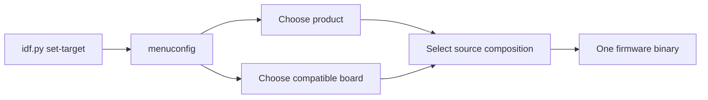

# Variantes de firmware selecionáveis pelo `menuconfig`

**Estado normativo:** Proposed
**Estado da implementação:** Not Started
**Revisão de implementabilidade:** Needs Clarification
**Prontidão:** Not Ready

## Missão

Permitir que um único projeto ESP-IDF produza firmwares de produtos diferentes,
selecionados no SDK Configuration Editor, sem copiar o runtime ISSP e sem
espalhar condicionais de produto pelos componentes compartilhados.

Esta mudança deve usar o experimento como prova prática da EKOM: o mapa e a
árvore de conhecimento precisam fornecer contexto suficiente para orientar a
implementação e a evolução de uma variante sem exigir redescobrir a arquitetura
do repositório.

## Resultado que buscamos

- acelerar a localização dos pontos corretos para criar ou alterar um produto;
- aumentar a qualidade mantendo produto, hardware e plataforma em fronteiras
  explícitas;
- aumentar a confiança de que uma nova variante não altera protocolo,
  commissioning ou outro produto por acidente;
- produzir um binário com uma única composição de produto e placa;
- tornar visível por que cada arquivo existe e qual direção de dependência é
  permitida.

## Pergunta central de contexto

> Para adicionar ou modificar uma variante de produto, onde devo atuar e o que
> devo preservar para não acoplar regras do produto à plataforma compartilhada?

A resposta começa na visão de domínio de `docs/rfc/KNOWLEDGE-MAP.md` e é
completada por esta especificação: escolha em `Kconfig`, composição no product
firmware, detalhes elétricos no board model, capabilities em componentes
reutilizáveis e runtime comum em `SmartSysApp`/`issp_*`.

## Estado atual observado

Hoje `client_154/main/main.cpp` concentra o entrypoint e a composição do único
produto existente. Ele define a identidade do dispositivo, GPIO do relé, GPIO e
tempos do factory reset, endpoint e tipo de evento; registra uma capability de
tomada e inicia `SmartSysApp`.

`components/issp_app_154` já fornece a fachada compartilhada `SmartSysApp` e
compõe internamente core, behavior, transporte, commissioning, reports e reset.
Os componentes `issp_core`, `issp_transport_154` e `issp_behaviors` já possuem
fronteiras CMake e contratos públicos. Não existe hoje `Kconfig.projbuild` no
`client_154`, catálogo de boards ou pasta de variantes.

Esse estado fornece um bom ponto de corte: a futura mudança extrai de
`main.cpp` somente a composição específica do produto; não reabre a arquitetura
interna validada de `SmartSysApp` ou dos componentes ISSP.

## Escopo

- uma seção `IoTSmartLink15.4` no `menuconfig`;
- escolha exclusiva de um product firmware;
- escolha exclusiva de um board model compatível;
- composição em build somente da variante e do board escolhidos;
- entrypoint mínimo, sem regras de produto;
- módulos separados para product firmwares e definições de board;
- uso das APIs públicas existentes de `SmartSysApp` e dos componentes;
- compatibilidade explícita entre product firmware, board model e
  `IDF_TARGET`;
- primeira migração do produto atual de tomada simples como prova de
  preservação;
- espaço arquitetural para as variantes tomada dupla + luz, sensor de porta e
  sensor de presença, sem exigir que todas sejam implementadas na primeira
  entrega funcional.

## Fora de escopo

- implementar qualquer variante nesta etapa de especificação;
- alterar protocolo wire, transporte, commissioning, ACK, retry, reports, NVS
  ou factory reset;
- selecionar ou mudar o chip alvo do ESP-IDF pelo `menuconfig`;
- tornar componentes conscientes de produto ou placa;
- carregar duas variantes no mesmo binário ou selecionar produto em runtime;
- criar geração de código, sistema próprio de plugins ou framework genérico de
  boards;
- definir nomes comerciais de placas que ainda não estejam confirmados;
- alterar o coordenador, publicar firmware, fazer deploy ou merge na `main`.

## Conceitos e fronteiras

| Conceito | Responsabilidade | Conhece | Não conhece |
|---|---|---|---|
| Plataforma compartilhada | ciclo de vida da aplicação, ISSP, transporte, commissioning, reports, persistência e reset | contratos técnicos e infraestrutura | modelo comercial, combinação de features ou pinagem de um produto |
| Componente reutilizável | uma capability ou behavior isolado e configurável, como saída digital | seu contrato, configuração e abstrações da plataforma | qual produto o usa e qual opção do `menuconfig` o selecionou |
| Product firmware / variant | identidade e composição de capabilities e serviços que definem um produto | APIs públicas, contrato do board e regras do próprio produto | detalhes privados do ISSP, rádio ou outra variante |
| Board model | pinagem, polaridade, recursos físicos e compatibilidade com o chip alvo | propriedades elétricas da placa | protocolo, regras do produto e fluxo do `menuconfig` |
| Seleção de build | escolhe exatamente uma composição válida e informa o CMake | símbolos de variante, board e `IDF_TARGET` | estado em runtime ou lógica interna dos componentes |

`ESP32-H2` e `ESP32-C6` são targets/chips, não nomes suficientes de board
model. Um board model deve representar uma placa concreta e declarar com qual
target é compatível. Até os nomes reais serem confirmados, a implementação deve
usar um identificador descritivo para a fiação atual do client, sem inventar um
nome comercial.

## Visão do domínio

A árvore do repositório, o diagrama que conecta client e coordenador e o ramo
proposto de variantes estão em `docs/rfc/KNOWLEDGE-MAP.md`. Esse mapa é a porta
de entrada para localizar o client dentro do sistema e navegar por suas
responsabilidades; esta especificação permanece responsável pelo comportamento
da seleção, pelas decisões, restrições e critérios de aceite.

## Fluxo de seleção



O `menuconfig` não muda `IDF_TARGET`. Ele apenas impede ou rejeita combinações
incompatíveis com o target já configurado pelo ESP-IDF.

## Decisões e restrições arquiteturais

1. `Kconfig` escolhe a composição do build; ele não controla lógica interna de
   componentes. Símbolos `CONFIG_*` não devem aparecer em `components/issp_*`.
2. Cada build contém exatamente um product firmware e um board model.
3. O CMake traduz a escolha em um conjunto de fontes. Não se compila todas as
   variantes para decidir em runtime.
4. Condicionais de seleção ficam concentradas em `Kconfig.projbuild` e no
   `CMakeLists.txt` do componente `main`. Não se permite uma árvore de `#ifdef`
   dentro de classes de produto ou componentes.
5. `app_main()` apenas obtém a composição selecionada, inicia a aplicação e
   registra o resultado; identidade, capabilities e regras do produto ficam na
   variante.
6. O product firmware recebe uma definição de board por contrato, sem usar
   números de GPIO próprios. O board não instancia capabilities nem inicia a
   plataforma.
7. Capabilities comuns continuam configuráveis e reutilizáveis. Uma nova
   capability só entra em `components/` quando tiver contrato próprio e utilidade
   além da composição de uma única variante.
8. A migração da tomada simples deve preservar os valores atuais: device ID
   `0x15400001`, relé no GPIO 13 ativo em nível alto, reset no GPIO 9 ativo em
   nível baixo por 10 segundos, endpoint 1, event type 2, estado inicial
   desligado e report inicial habilitado.
9. A compatibilidade board/target deve falhar na configuração ou no build com
   mensagem clara. Não se aceita binário silenciosamente configurado para a
   placa errada.
10. A primeira implementação deve ser pequena. Abstrações adicionais só serão
    criadas quando uma segunda variante demonstrar a necessidade.

## Experiência proposta no `menuconfig`

```text
IoTSmartLink15.4
├── Product firmware
│   ├── Single smart plug
│   ├── Dual smart plug + light
│   ├── Door sensor
│   └── Motion sensor
└── Board model
    └── <boards reais compatíveis com o IDF_TARGET>
```

Opções futuras ainda não implementadas podem permanecer fora do `choice` até
possuírem composição compilável. O menu não deve oferecer uma seleção que
inevitavelmente falhe por ausência de código.

## Estrutura proposta de arquivos

```text
client_154/
├── CMakeLists.txt
└── main/
    ├── Kconfig.projbuild
    ├── CMakeLists.txt
    ├── app_main.cpp
    ├── product_firmware.hpp
    ├── firmwares/
    │   ├── single_smart_plug.cpp
    │   ├── dual_smart_plug_light.cpp
    │   ├── door_sensor.cpp
    │   └── motion_sensor.cpp
    └── boards/
        ├── board_model.hpp
        └── <board_model>.cpp

components/
├── issp_app_154/
├── issp_behaviors/
├── issp_core/
└── issp_transport_154/
```

Na primeira implementação, somente arquivos de variantes e boards realmente
suportados devem existir. A árvore completa mostra o destino do conhecimento,
não autoriza criar stubs vazios.

## Pontos reais do código afetados na implementação futura

| Ponto atual | Mudança futura esperada | Preservação obrigatória |
|---|---|---|
| `client_154/main/main.cpp` | tornar-se `app_main.cpp` mínimo e mover a composição atual para `firmwares/single_smart_plug.cpp` | sequência observável de configuração e `setup()` |
| `client_154/main/CMakeLists.txt` | selecionar somente as fontes da variante e do board configurados | dependência pública apenas em `issp_app_154`, salvo necessidade comprovada |
| `client_154/main/Kconfig.projbuild` | novo menu com escolhas exclusivas e restrições de target | seleção concentrada, sem lógica funcional |
| `client_154/main/product_firmware.hpp` | contrato mínimo comum para iniciar a composição selecionada | não expor tipos privados `issp_*` |
| `client_154/main/firmwares/` | composição, identidade e regras de cada produto | nenhuma pinagem literal e nenhuma lógica de transporte |
| `client_154/main/boards/` | pinagem, polaridade, recursos e compatibilidade | nenhuma regra de produto ou protocolo |
| `client_154/CMakeLists.txt` | somente se necessário para localizar novos componentes locais | preservar `EXTRA_COMPONENT_DIRS` compartilhado e `MINIMAL_BUILD` |
| `components/issp_app_154` | nenhuma mudança prevista para a primeira migração | API pública e comportamento validados |
| `components/issp_behaviors` | ampliar apenas quando uma nova capability concreta exigir | independência de variante, board e `Kconfig` |
| `docs/rfc/KNOWLEDGE-MAP.md` | apontar para esta especificação e, depois, para a implementação validada | não duplicar o contrato |

## Critérios de aceite

### Seleção e build

- **Dado** um `IDF_TARGET` suportado, **quando** o desenvolvedor abre o SDK
  Configuration Editor, **então** encontra uma seção `IoTSmartLink15.4` com uma
  escolha de product firmware e uma escolha de board model.
- **Dado** o menu de produto, **quando** uma variante é selecionada, **então**
  nenhuma segunda variante pode permanecer selecionada.
- **Dado** um par produto/board válido, **quando** o projeto é configurado e
  compilado, **então** somente as fontes desse produto e desse board entram no
  binário.
- **Dado** um board incompatível com `IDF_TARGET`, **quando** a configuração ou
  o build é executado, **então** a combinação é impedida com diagnóstico claro.

### Fronteiras

- **Dada** uma nova variante, **quando** ela é adicionada, **então** sua
  composição não exige alterar lógica interna de `issp_core`,
  `issp_transport_154`, `issp_app_154` ou uma variante existente.
- **Dado** o código compartilhado, **quando** ele é inspecionado, **então** não
  há símbolo `CONFIG_*` de seleção de produto ou board em `components/issp_*`.
- **Dado** um product firmware, **quando** sua composição é inspecionada,
  **então** ele usa o contrato do board e não contém GPIO literal.
- **Dado** o entrypoint, **quando** ele é inspecionado, **então** não contém
  pinagem, identidade, endpoints ou lista de capabilities de um produto.

### Preservação do produto atual

- **Dada** a seleção da tomada simples e do board que representa a fiação
  atual, **quando** o firmware inicia, **então** identidade, relé, reset,
  endpoint, evento, estado inicial e report inicial são configurados com os
  mesmos valores do baseline observado.
- **Dada** a migração estrutural, **quando** os testes e builds vigentes são
  executados, **então** a API de `SmartSysApp`, o protocolo e o comportamento
  compartilhado permanecem inalterados.

### Navegabilidade EKOM

- **Dados** o mapa de conhecimento e esta especificação, **quando** alguém
  recebe a tarefa de adicionar o sensor de porta, **então** consegue identificar
  onde registrar a seleção, onde compor o produto, onde definir a placa e o que
  não deve alterar.
- **Dada** uma dúvida sobre a localização de uma regra, **quando** se aplica a
  regra de navegação da árvore, **então** ela conduz a uma única fronteira
  principal: seleção, product firmware, board, componente ou plataforma.

## Estratégia de validação do experimento EKOM

O experimento será avaliado durante a primeira implementação, não pelo volume
do documento.

1. **Teste de orientação:** entregar a pergunta “como adicionar o sensor de
   porta?” usando somente o mapa e esta especificação. A resposta deve apontar
   os pontos de extensão e as fronteiras preservadas sem varredura ampla do
   repositório.
2. **Teste de mudança controlada:** migrar primeiro a tomada simples. O diff
   deve permanecer concentrado nos pontos reais listados acima e não alterar a
   plataforma compartilhada.
3. **Teste de segunda composição:** planejar ou criar uma segunda variante. Se
   isso exigir condicionais internas nos componentes ou duplicação de runtime,
   a arquitetura ou o mapa falhou e deve ser revisto.
4. **Teste de classificação:** avaliar onde seriam colocados “GPIO da placa”,
   “composição de capabilities do sensor” e “retry do rádio”. A árvore deve
   conduzir respectivamente a board model, product firmware e plataforma.
5. **Teste de seleção:** inspecionar os artefatos de build para confirmar uma
   única variante e um único board, além de executar um caso de incompatibilidade
   board/target.
6. **Teste de preservação:** comparar a composição da tomada simples com os
   valores de baseline e executar os testes de `SmartSysApp` e builds relevantes
   definidos pela futura especificação implementável.

O experimento é útil se reduzir a redescoberta, tornar os limites previsíveis e
permitir explicar o diff antes de escrevê-lo. Ele falha se o implementador ainda
precisar vasculhar o repositório para descobrir responsabilidades, se duas
fronteiras disputarem a mesma regra ou se o menu apenas esconder um firmware
monolítico cheio de condicionais.

## Questões para decisão antes da implementação

- quais são os nomes reais e as revisões dos boards inicialmente suportados;
- qual board corresponde oficialmente à fiação atual do `client_154`;
- qual segunda variante será usada para provar que a separação não serve apenas
  à tomada simples;
- quais combinações produto/board devem ser oferecidas no primeiro menu;
- se o contrato mínimo de product firmware será função livre ou interface; a
  opção mais simples que suportar duas variantes deve prevalecer.

## Resultado desta etapa

O Consultor de Arquitetura preparou esta especificação após inspecionar o
entrypoint do `client_154`, os componentes compartilhados e as fontes EKOM
pertinentes. Somente documentação foi alterada; nenhuma implementação funcional
foi iniciada. O resultado está pronto para revisão, sem representar aprovação
arquitetural ou autorização para implementar.

## Revisão de implementabilidade (Engenheiro Analista)

**Resultado:** Precisa de esclarecimento [`Needs Clarification`] para a versão
integral. Preserva `Not Started` e `Not Ready`; não autoriza início de
implementação.

A Fase 1 estrutural (migração da tomada simples com um único board) é
tecnicamente viável e tem escopo de diff determinado, mas não fica implementável
enquanto o bloqueio 1 não for decidido, porque ele condiciona um critério de
aceite obrigatório da própria Fase 1.

### Viabilidade técnica confirmada contra o código

- `client_154/main` é componente ESP-IDF registrado por `idf_component_register`,
  então `main/Kconfig.projbuild` é o mecanismo padrão para criar a seção de topo
  `IoTSmartLink15.4`. Não há `Kconfig*` no repositório hoje: a proposta não tem
  precedente local direto, mas também não cria camada nova — fica contida em
  `client_154/main`, dentro do que a decisão 4 autoriza;
- a seleção condicional de fontes tem precedente local direto em
  `components/issp_app_154/CMakeLists.txt`, que monta a lista `srcs`
  condicionalmente e a passa a `idf_component_register`. Trocar a condição de
  `IDF_TARGET` por símbolo `CONFIG_*` usa o mesmo padrão;
- os valores de baseline da decisão 8 conferem exatamente com
  `client_154/main/main.cpp`;
- nenhum símbolo `CONFIG_*` de seleção de produto ou board existe hoje em
  `components/issp_*`; o único uso é `CONFIG_IDF_TARGET_*`, próprio do ESP-IDF;
- `client_154/CMakeLists.txt` não precisa de mudança: `EXTRA_COMPONENT_DIRS` já
  aponta para `../components`, e `firmwares/`/`boards/` ficam dentro de `main`;
- `examples/issp_minimal_client`, segundo consumidor da fachada, não é afetado.

### Suficiência da API pública de `SmartSysApp`

- suficiente para a tomada simples: `addSwitchPlugCapability`,
  `configureFactoryResetButton` e `setup()` são exatamente o que `main.cpp` usa
  hoje, sem expor tipo `issp_*`;
- suficiente também para tomada dupla + luz:
  `kMaxSwitchCapabilities = kMaxDeviceBehaviors = 8` permite múltiplas saídas
  pela mesma API;
- insuficiente para sensor de porta e sensor de presença: não existe capability
  de entrada na fachada nem behavior de entrada em `issp_behaviors`. Essas
  variantes exigiriam estender a API pública governada por
  `docs/specs/ISSP-Configurable-Bootstrap.md`, hoje `Active`/`Validated`.

Consequência: a escolha da segunda variante não é indiferente. Ela determina se
o experimento se fecha dentro do recorte atual ou se abre trabalho na plataforma
compartilhada.

### Bloqueio 1 — compatibilidade board/`IDF_TARGET` (afeta a Fase 1)

A decisão 9 e o critério "board incompatível com `IDF_TARGET`" exigem falha
diagnosticável, mas a especificação não declara com quais targets a fiação atual
do `client_154` é compatível. O fato não é derivável do código — GPIO 13 e GPIO 9
existem em ESP32-H2 e ESP32-C6 — e as fontes locais conflitam:

- o mapa de conhecimento valida apenas ESP32-H2 para o `client_154`;
- `components/issp_app_154/CMakeLists.txt` trata `esp32h2` e `esp32c6` como
  targets de hardware completos;
- `client_154/sdkconfig.esp32c6` e os diretórios `build_esp32c6` existem, mas são
  anteriores à migração do bootstrap e não comprovam buildabilidade atual.

Ambas as saídas exigem inferência de produto: um board apenas H2 estreita
silenciosamente o alcance de targets do client; um board H2 + C6 elimina
qualquer par incompatível na Fase 1 e torna o critério obrigatório não avaliável.
Conforme a preservação arquitetural das regras comuns, o conflito de precedentes
é registrado e a decisão devolvida ao Arquiteto.

### Bloqueio 2 — conjunto de validação e oráculo da preservação

- o critério "os testes e builds vigentes são executados" não nomeia nenhum
  build ou teste, e o teste 6 da estratégia delega o conjunto "à futura
  especificação implementável", que é esta própria versão;
- o critério "quando o firmware inicia, então identidade, relé, reset, endpoint,
  evento, estado inicial e report inicial são configurados com os mesmos
  valores" exige comportamento executado. A composição real não roda sob QEMU:
  os testes vigentes de `SmartSysApp` usam `SetupHooks` e modelo `esp32c3`, sem
  rádio. É preciso declarar se o oráculo é equivalência estática da composição ou
  validação em hardware ESP32-H2 pelo Arquiteto;
- os critérios de aceite desta especificação não possuem identificadores
  estáveis, ao contrário do precedente de `ISSP-Configurable-Bootstrap.md`
  (`SMARTAPP-AC-*`), o que dificulta rastrear aprovação, reprovação e ausência de
  execução.

### Fase 1 e encerramento do experimento

A escolha da segunda variante **não bloqueia escrever a Fase 1**:
`Kconfig.projbuild`, seleção no CMake, `app_main.cpp` mínimo,
`firmwares/single_smart_plug.cpp` e o board da fiação atual são determinados pelo
estado atual do código, e o contrato mínimo por função livre selecionada no CMake
suporta qualquer segunda variante sem retrabalho estrutural.

Ela **bloqueia encerrar o experimento**: o teste 3 é exatamente essa prova, e a
escolha muda o custo arquitetural conforme a suficiência da API acima. Não
implementar todas as variantes autoriza entregar uma composição compilável de
cada vez; não autoriza declarar a separação provada com uma só.

### Avaliação individual dos seis testes da estratégia EKOM

| # | Teste | Executável na Fase 1 | Dependência exata |
|---|---|---|---|
| 1 | Orientação | Sim | Nenhuma; é navegação por mapa e especificação, não exige código do sensor. Falta apenas o protocolo de evidência: pergunta feita, resposta obtida e fontes consultadas |
| 2 | Mudança controlada | Sim | Oráculo disponível: escopo do diff contra a tabela de pontos reais afetados |
| 3 | Segunda composição | Não | Escolha da segunda variante pelo Arquiteto; planejar também depende dela, porque tomada dupla + luz e os sensores têm consequências opostas na API pública |
| 4 | Classificação | Sim | Nenhuma; é exercício de taxonomia contra a árvore de conhecimento |
| 5 | Seleção | Parcial | Confirmar uma variante e um board nos artefatos de build é executável. O caso de incompatibilidade não exige segundo board — basta um target não suportado — mas depende do bloqueio 1 |
| 6 | Preservação | Parcial | A comparação estática dos valores de baseline é executável; a parte executada e o conjunto de builds e testes dependem do bloqueio 2 |

Nenhum teste é excluído por conveniência: apenas o teste 3 está integralmente
bloqueado, e os testes 5 e 6 têm parte executável e parte dependente dos bloqueios
registrados acima.

### Decisões reservadas ao Arquiteto

1. targets compatíveis com a fiação atual do `client_154` e se ESP32-C6 é target
   suportado do client (bloqueia a Fase 1);
2. oráculo do critério de preservação e conjunto nomeado de builds e testes
   (bloqueia a Fase 1);
3. qual segunda variante prova a separação e, se for um sensor, autorização
   prévia para estender a API governada por `ISSP-Configurable-Bootstrap.md`
   (bloqueia o encerramento do experimento, não a Fase 1);
4. nomes e revisões reais dos boards; o identificador descritivo autorizado vira
   símbolo `CONFIG_*` público e terá custo de renomeação posterior (não
   bloqueante);
5. se `client_154/sdkconfig` versionado deve receber os novos símbolos e qual é o
   default explícito da escolha de produto (não bloqueante).

As questões 1, 4 e 5 da seção "Questões para decisão antes da implementação" não
são bloqueantes. A questão 2 é bloqueante apenas quanto à compatibilidade de
target, não quanto ao nome. A questão 3 bloqueia somente o encerramento do
experimento. A questão 5 é grau de liberdade de implementação já delegado pela
própria especificação.

### Preservação de estado

Esta atuação não alterou código, teste ou configuração de implementação. O estado
da implementação permanece `Not Started`; uma ordem posterior do Arquiteto é
necessária após a resolução dos bloqueios registrados.
