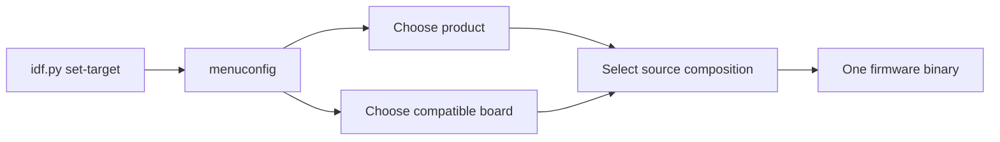

# Variantes de firmware selecionáveis pelo `menuconfig`

**Estado normativo:** Proposed
**Estado da implementação:** In Progress
**Revisão de implementabilidade:** Implementable — decisão do Arquiteto para a versão integral
**Prontidão:** Ready

## Missão

Permitir que um único projeto ESP-IDF produza firmwares de produtos diferentes,
selecionados no SDK Configuration Editor, sem copiar o runtime ISSP e sem
espalhar condicionais de produto pelos componentes compartilhados.

Esta mudança deve usar o experimento como prova prática da EKOM: o mapa e a
árvore de conhecimento precisam fornecer contexto suficiente para orientar a
implementação e a evolução de uma variante sem exigir redescobrir a arquitetura
do repositório.

## Resultado que buscamos

- acelerar a localização dos pontos corretos para criar ou alterar um produto;
- aumentar a qualidade mantendo produto, hardware e plataforma em fronteiras
  explícitas;
- aumentar a confiança de que uma nova variante não altera protocolo,
  commissioning ou outro produto por acidente;
- produzir um binário com uma única composição de produto e placa;
- tornar visível por que cada arquivo existe e qual direção de dependência é
  permitida.

## Pergunta central de contexto

> Para adicionar ou modificar uma variante de produto, onde devo atuar e o que
> devo preservar para não acoplar regras do produto à plataforma compartilhada?

A resposta começa na visão de domínio de `docs/rfc/KNOWLEDGE-MAP.md` e é
completada por esta especificação: escolha em `Kconfig`, composição no product
firmware, detalhes elétricos no board model, capabilities em componentes
reutilizáveis e runtime comum em `SmartSysApp`/`issp_*`.

## Estado atual observado

> Esta seção descreve o baseline anterior à Fase 1, usado pela análise de
> implementabilidade. O estado vigente está em “Resultado da implementação da
> Fase 1”.

Antes da Fase 1, `client_154/main/main.cpp` concentrava o entrypoint e a
composição do único produto existente. Ele definia a identidade do dispositivo,
GPIO do relé, GPIO e tempos do factory reset, endpoint e tipo de evento;
registrava uma capability de tomada e iniciava `SmartSysApp`.

`components/issp_app_154` já fornece a fachada compartilhada `SmartSysApp` e
compõe internamente core, behavior, transporte, commissioning, reports e reset.
Os componentes `issp_core`, `issp_transport_154` e `issp_behaviors` já possuíam
fronteiras CMake e contratos públicos. Não existia `Kconfig.projbuild` no
`client_154`, catálogo de boards ou pasta de variantes.

Esse estado forneceu um bom ponto de corte: a mudança extraiu de `main.cpp`
somente a composição específica do produto; não reabriu a arquitetura interna
validada de `SmartSysApp` ou dos componentes ISSP.

## Escopo

- uma seção `IoTSmartLink15.4` no `menuconfig`;
- escolha exclusiva de um product firmware;
- escolha exclusiva de um board model compatível;
- composição em build somente da variante e do board escolhidos;
- entrypoint mínimo, sem regras de produto;
- módulos separados para product firmwares e definições de board;
- uso das APIs públicas existentes de `SmartSysApp` e dos componentes;
- compatibilidade explícita entre product firmware, board model e
  `IDF_TARGET`;
- primeira migração do produto atual de tomada simples como prova de
  preservação;
- espaço arquitetural para as variantes tomada dupla + luz, sensor de porta e
  sensor de presença, sem exigir que todas sejam implementadas na primeira
  entrega funcional.

### Fase 1 — recorte funcional inicial

A primeira implementação funcional contém somente:

- product firmware `Single smart plug`, selecionado por padrão;
- board model descritivo `Current client ESP32-H2 wiring`, selecionado por
  padrão e compatível exclusivamente com `IDF_TARGET=esp32h2`;
- migração da composição atual para as novas fronteiras, sem alterar a
  plataforma compartilhada.

ESP32-C6 não é target suportado desse board nesta fase. Configurar esse board
com `IDF_TARGET=esp32c6` deve falhar com diagnóstico explícito da
incompatibilidade, antes de produzir um firmware utilizável.

A Fase 1 comprova a seleção, as fronteiras e a preservação do produto atual. Ela
não encerra o experimento de múltiplas variantes: esse encerramento exige uma
segunda composição escolhida pelo Arquiteto e o teste 3 da estratégia EKOM.

## Fora de escopo

- implementar qualquer variante nesta etapa de especificação;
- alterar protocolo wire, transporte, commissioning, ACK, retry, reports, NVS
  ou factory reset;
- selecionar ou mudar o chip alvo do ESP-IDF pelo `menuconfig`;
- tornar componentes conscientes de produto ou placa;
- carregar duas variantes no mesmo binário ou selecionar produto em runtime;
- criar geração de código, sistema próprio de plugins ou framework genérico de
  boards;
- definir nomes comerciais de placas que ainda não estejam confirmados;
- alterar o coordenador, publicar firmware, fazer deploy ou merge na `main`.

## Conceitos e fronteiras

| Conceito | Responsabilidade | Conhece | Não conhece |
|---|---|---|---|
| Plataforma compartilhada | ciclo de vida da aplicação, ISSP, transporte, commissioning, reports, persistência e reset | contratos técnicos e infraestrutura | modelo comercial, combinação de features ou pinagem de um produto |
| Componente reutilizável | uma capability ou behavior isolado e configurável, como saída digital | seu contrato, configuração e abstrações da plataforma | qual produto o usa e qual opção do `menuconfig` o selecionou |
| Product firmware / variant | identidade e composição de capabilities e serviços que definem um produto | APIs públicas, contrato do board e regras do próprio produto | detalhes privados do ISSP, rádio ou outra variante |
| Board model | pinagem, polaridade, recursos físicos e compatibilidade com o chip alvo | propriedades elétricas da placa | protocolo, regras do produto e fluxo do `menuconfig` |
| Seleção de build | escolhe exatamente uma composição válida e informa o CMake | símbolos de variante, board e `IDF_TARGET` | estado em runtime ou lógica interna dos componentes |

`ESP32-H2` e `ESP32-C6` são targets/chips, não nomes suficientes de board
model. Um board model deve representar uma placa concreta e declarar com qual
target é compatível. Até os nomes reais serem confirmados, a implementação deve
usar um identificador descritivo para a fiação atual do client, sem inventar um
nome comercial.

Para a Fase 1, o identificador descritivo representa a fiação vigente do
`client_154` e declara somente ESP32-H2 como target compatível. Suporte futuro
ao ESP32-C6 requer board model próprio ou ampliação explícita da compatibilidade,
acompanhada de validação correspondente.

## Visão do domínio

A árvore do repositório, o diagrama que conecta client e coordenador e o ramo
proposto de variantes estão em `docs/rfc/KNOWLEDGE-MAP.md`. Esse mapa é a porta
de entrada para localizar o client dentro do sistema e navegar por suas
responsabilidades; esta especificação permanece responsável pelo comportamento
da seleção, pelas decisões, restrições e critérios de aceite.

## Fluxo de seleção



O `menuconfig` não muda `IDF_TARGET`. Ele apenas impede ou rejeita combinações
incompatíveis com o target já configurado pelo ESP-IDF.

## Decisões e restrições arquiteturais

1. `Kconfig` escolhe a composição do build; ele não controla lógica interna de
   componentes. Símbolos `CONFIG_*` não devem aparecer em `components/issp_*`.
2. Cada build contém exatamente um product firmware e um board model.
3. O CMake traduz a escolha em um conjunto de fontes. Não se compila todas as
   variantes para decidir em runtime.
4. Condicionais de seleção ficam concentradas em `Kconfig.projbuild` e no
   `CMakeLists.txt` do componente `main`. Não se permite uma árvore de `#ifdef`
   dentro de classes de produto ou componentes.
5. `app_main()` apenas obtém a composição selecionada, inicia a aplicação e
   registra o resultado; identidade, capabilities e regras do produto ficam na
   variante.
6. O product firmware recebe uma definição de board por contrato, sem usar
   números de GPIO próprios. O board não instancia capabilities nem inicia a
   plataforma.
7. Capabilities comuns continuam configuráveis e reutilizáveis. Uma nova
   capability só entra em `components/` quando tiver contrato próprio e utilidade
   além da composição de uma única variante.
8. A migração da tomada simples deve preservar os valores atuais: device ID
   `0x15400001`, relé no GPIO 13 ativo em nível alto, reset no GPIO 9 ativo em
   nível baixo por 10 segundos com polling de 20 ms, endpoint 1, event type 2,
   estado inicial desligado e report inicial habilitado.
9. A compatibilidade board/target deve falhar na configuração ou no build com
   mensagem clara. Não se aceita binário silenciosamente configurado para a
   placa errada. Na Fase 1, o board atual aceita somente ESP32-H2; ESP32-C6 é o
   caso negativo obrigatório.
10. A primeira implementação deve ser pequena. Abstrações adicionais só serão
    criadas quando uma segunda variante demonstrar a necessidade.
11. A forma interna do contrato de seleção não é uma decisão arquitetural
    antecipada. A implementação deve usar o menor mecanismo local que satisfaça
    o entrypoint mínimo e a seleção pelo CMake, sem criar abstração transversal.
12. A partir da segunda variante ou do segundo board, cada product firmware deve
    declarar os recursos físicos de que depende e cada board model deve declarar
    os recursos que oferece. A seleção de build deve rejeitar combinações
    incompatíveis com diagnóstico claro antes de produzir o binário.
13. A forma atual de `BoardModel` é local e provisória para a Fase 1, não um
    contrato estável. Os campos `relayPin`, `relayActiveHigh`,
    `factoryResetButtonPin` e `factoryResetButtonActiveLow` podem ser
    substituídos na Fase 2, quando a segunda variante revelar o vocabulário de
    recursos físicos necessário; não devem ser generalizados antecipadamente.
14. Por decisão do Arquiteto, a versão integral é `Implementable` antes de a
    segunda variante e o mecanismo da decisão 12 estarem definidos. Essas
    incertezas são variáveis deliberadas do experimento, não bloqueadores de
    implementabilidade. A ordem da Fase 2 deve identificar a variante exercitada;
    o Implementador deve adotar o menor mecanismo local que satisfaça as decisões
    12 e 13, registrar as consequências observadas e devolver ao Arquiteto
    qualquer necessidade de ampliar componentes ou contratos compartilhados.

### Registro de conhecimento deste experimento

Por decisão do Arquiteto, este experimento não abre nem atualiza uma transação
`EKM-CHG`. O conhecimento material da implementação deve ser reconciliado de
forma concisa nesta especificação e em `docs/rfc/KNOWLEDGE-MAP.md`; o Git
preserva a linhagem técnica. Essa exceção vale somente para este experimento e
não modifica a governança geral do repositório.

## Experiência proposta no `menuconfig`

```text
IoTSmartLink15.4
├── Product firmware
│   └── Single smart plug (default da Fase 1)
└── Board model
    └── Current client ESP32-H2 wiring (default da Fase 1)
```

Dual smart plug + light, door sensor e motion sensor permanecem fora do `choice`
até possuírem composição compilável e decisão arquitetural aplicável. O menu não
deve oferecer uma seleção que inevitavelmente falhe por ausência de código.

## Estrutura proposta de arquivos

```text
client_154/
├── CMakeLists.txt
└── main/
    ├── Kconfig.projbuild
    ├── CMakeLists.txt
    ├── app_main.cpp
    ├── product_firmware.hpp
    ├── firmwares/
    │   ├── single_smart_plug.cpp
    │   ├── dual_smart_plug_light.cpp
    │   ├── door_sensor.cpp
    │   └── motion_sensor.cpp
    └── boards/
        ├── board_model.hpp
        └── <board_model>.cpp

components/
├── issp_app_154/
├── issp_behaviors/
├── issp_core/
└── issp_transport_154/
```

Na primeira implementação, somente arquivos de variantes e boards realmente
suportados devem existir. A árvore completa mostra o destino do conhecimento,
não autoriza criar stubs vazios.

## Pontos reais do código afetados na implementação futura

| Ponto atual | Mudança futura esperada | Preservação obrigatória |
|---|---|---|
| `client_154/main/main.cpp` | tornar-se `app_main.cpp` mínimo e mover a composição atual para `firmwares/single_smart_plug.cpp` | sequência observável de configuração e `setup()` |
| `client_154/main/CMakeLists.txt` | selecionar somente as fontes da variante e do board configurados | dependência pública apenas em `issp_app_154`, salvo necessidade comprovada |
| `client_154/main/Kconfig.projbuild` | novo menu com escolhas exclusivas e restrições de target | seleção concentrada, sem lógica funcional |
| `client_154/main/product_firmware.hpp` | contrato mínimo comum para iniciar a composição selecionada | não expor tipos privados `issp_*` |
| `client_154/main/firmwares/` | composição, identidade e regras de cada produto | nenhuma pinagem literal e nenhuma lógica de transporte |
| `client_154/main/boards/` | pinagem, polaridade, recursos e compatibilidade | nenhuma regra de produto ou protocolo |
| `client_154/CMakeLists.txt` | somente se necessário para localizar novos componentes locais | preservar `EXTRA_COMPONENT_DIRS` compartilhado e `MINIMAL_BUILD` |
| `components/issp_app_154` | nenhuma mudança prevista para a primeira migração | API pública e comportamento validados |
| `components/issp_behaviors` | ampliar apenas quando uma nova capability concreta exigir | independência de variante, board e `Kconfig` |
| `docs/rfc/KNOWLEDGE-MAP.md` | apontar para esta especificação e, depois, para a implementação validada | não duplicar o contrato |

## Critérios de aceite

### Seleção e build

- **Dado** um `IDF_TARGET` suportado, **quando** o desenvolvedor abre o SDK
  Configuration Editor, **então** encontra uma seção `IoTSmartLink15.4` com uma
  escolha de product firmware e uma escolha de board model.
- **Dado** o menu de produto com duas ou mais variantes implementadas, **quando**
  uma variante é selecionada a partir da Fase 2, **então** nenhuma segunda
  variante pode permanecer selecionada.
- **Dado** um par produto/board válido, **quando** o projeto é configurado e
  compilado, **então** somente as fontes desse produto e desse board entram no
  binário.
- **Dado** o board atual da Fase 1 e `IDF_TARGET=esp32c6`, **quando** a
  configuração ou o build é executado, **então** a combinação é impedida com
  diagnóstico claro de que esse board aceita somente ESP32-H2.
- **Dado** um product firmware cujos recursos exigidos não são oferecidos pelo
  board selecionado, **quando** a configuração ou o build é executado a partir
  da Fase 2, **então** a combinação é impedida com diagnóstico que identifica o
  produto, o board e o recurso ausente.

### Fronteiras

- **Dada** uma nova variante, **quando** ela é adicionada, **então** sua
  composição não exige alterar lógica interna de `issp_core`,
  `issp_transport_154`, `issp_app_154` ou uma variante existente.
- **Dado** o código compartilhado, **quando** ele é inspecionado, **então** não
  há símbolo `CONFIG_*` de seleção de produto ou board em `components/issp_*`.
- **Dado** um product firmware, **quando** sua composição é inspecionada,
  **então** ele usa o contrato do board e não contém GPIO literal.
- **Dado** o entrypoint, **quando** ele é inspecionado, **então** não contém
  pinagem, identidade, endpoints ou lista de capabilities de um produto.

### Preservação do produto atual

- **Dada** a seleção da tomada simples e do board que representa a fiação
  atual, **quando** o firmware inicia, **então** identidade, relé, reset,
  endpoint, evento, estado inicial e report inicial são configurados com os
  mesmos valores do baseline observado.
- **Dada** a migração estrutural, **quando** os testes e builds vigentes são
  executados, **então** a API de `SmartSysApp`, o protocolo e o comportamento
  compartilhado permanecem inalterados.

O primeiro cenário exige validação no hardware ESP32-H2. Comparação estática ou
build isolado não substituem a observação do firmware em execução.

### Navegabilidade EKOM

- **Dados** o mapa de conhecimento e esta especificação, **quando** alguém
  recebe a tarefa de adicionar o sensor de porta, **então** consegue identificar
  onde registrar a seleção, onde compor o produto, onde definir a placa e o que
  não deve alterar.
- **Dada** uma dúvida sobre a localização de uma regra, **quando** se aplica a
  regra de navegação da árvore, **então** ela conduz a uma única fronteira
  principal: seleção, product firmware, board, componente ou plataforma.

## Estratégia de validação do experimento EKOM

O experimento será avaliado durante a primeira implementação, não pelo volume
do documento.

1. **Teste de orientação:** entregar a pergunta “como adicionar o sensor de
   porta?” usando somente o mapa e esta especificação. A resposta deve apontar
   os pontos de extensão e as fronteiras preservadas sem varredura ampla do
   repositório.
2. **Teste de mudança controlada:** migrar primeiro a tomada simples. O diff
   deve permanecer concentrado nos pontos reais listados acima e não alterar a
   plataforma compartilhada.
3. **Teste de segunda composição:** depois da Fase 1, planejar ou criar a segunda
   variante escolhida pelo Arquiteto. Se isso exigir condicionais internas nos
   componentes ou duplicação de runtime, a arquitetura ou o mapa falhou e deve
   ser revisto. Este é o único teste integralmente diferido para o encerramento
   do experimento.
4. **Teste de classificação:** avaliar onde seriam colocados “GPIO da placa”,
   “composição de capabilities do sensor” e “retry do rádio”. A árvore deve
   conduzir respectivamente a board model, product firmware e plataforma.
5. **Teste de seleção:** inspecionar os artefatos de build para confirmar uma
   única variante e um único board, além de executar um caso de incompatibilidade
   board/target.
6. **Teste de preservação:** comparar a composição da tomada simples com os
   valores de baseline e executar o conjunto de validação definido abaixo.

### Conjunto de validação da Fase 1

- `git diff --check` e inspeção do diff contra a tabela de pontos afetados;
- configuração gerada contendo exatamente o product firmware e o board default;
- inspeção de `compile_commands.json` ou `build.ninja` comprovando que somente
  as fontes selecionadas entram no build;
- build do `client_154` para ESP32-H2 com ESP-IDF 6.0.1;
- build de `examples/issp_minimal_client` para ESP32-H2;
- execução da suíte de testes de `SmartSysApp` em QEMU ESP32-C3;
- build de `coordinator_154` para ESP32-C6;
- configuração ou build negativo do board da Fase 1 com target ESP32-C6,
  usando `SDKCONFIG` isolado fora da configuração H2 rastreada e contendo o
  diagnóstico esperado;
- validação no hardware ESP32-H2 de boot até `Running`, report inicial, comandos
  `ON`, `OFF` e `TOGGLE`, pressão de factory reset por 10 segundos, reboot e
  retorno ao commissioning. Essa execução comprova a preservação da migração e
  não declara resolvida a lacuna preexistente de ACK/retry (`EKM-GAP-0006`).

Para cada item, falha, execução não iniciada ou resultado desconhecido não
constitui aprovação. A evidência deve permitir distinguir aprovação, reprovação
e ausência de execução.

O experimento é útil se reduzir a redescoberta, tornar os limites previsíveis e
permitir explicar o diff antes de escrevê-lo. Ele falha se o implementador ainda
precisar vasculhar o repositório para descobrir responsabilidades, se duas
fronteiras disputarem a mesma regra ou se o menu apenas esconder um firmware
monolítico cheio de condicionais.

## Variáveis experimentais para encerrar o experimento

- nome e revisão comerciais do board podem substituir o identificador
  descritivo somente após confirmação do Arquiteto;
- a ordem de implementação da Fase 2 deve identificar a segunda variante a ser
  exercitada. Múltiplas saídas digitais são estruturalmente possíveis, mas isso
  não comprova uma semântica específica de luz. Sensor de porta ou presença
  exige autorização explícita para ampliar a API pública e os behaviors
  compartilhados;
- a representação dos recursos exigidos pelo produto e oferecidos pelo board é
  uma decisão local da implementação experimental, limitada pelas decisões 12,
  13 e 14. O resultado deve mostrar se esse grau de liberdade acelera a evolução
  ou apenas transfere contexto ausente para o Implementador.

Essas variáveis não bloqueiam o estado `Implementable` da versão integral. Elas
continuam impedindo a execução da Fase 2 sem uma ordem que identifique a segunda
variante e impedem o encerramento do experimento até produzirem evidência.

## Resultado desta etapa

O Arquiteto aprovou a direção arquitetural e confirmou o recorte H2 e o conjunto
de validação da Fase 1. O Consultor reconciliou essas decisões sem iniciar
implementação funcional. O Engenheiro Analista confrontou a versão reconciliada
e promoveu a revisão de implementabilidade para `Implementable`.

## Decisão vigente de implementabilidade

O Arquiteto declara a versão integral `Implementable` e `Ready`. A promoção é
deliberadamente anterior à definição da segunda variante e do mecanismo de
compatibilidade produto/board: o experimento deve revelar se a especificação e
o mapa fornecem contexto suficiente para o Implementador resolver o mecanismo
local e tornar visíveis as consequências. Essa decisão não promove a
implementação para `Implemented`, não declara validação e não autoriza ampliar
contratos compartilhados sem nova decisão do Arquiteto.

## Resultado da implementação da Fase 1 (Engenheiro Implementador)

**Estado da Fase 1:** Implementação concluída. Código, validações automatizáveis
e a validação em hardware ESP32-H2 exigida pelos critérios de preservação estão
executados; o Arquiteto declarou a execução em hardware aceitável.

A especificação integral permanece Em andamento [`In Progress`]: a Fase 2 e o
teste 3 da estratégia EKOM continuam sem implementação e sem evidência. A
conclusão da Fase 1 não representa a especificação integral como implementada.

### Estrutura implementada

```text
client_154/main/
├── Kconfig.projbuild                        menu IoTSmartLink15.4
├── CMakeLists.txt                           traduz a escolha em fontes
├── app_main.cpp                             entrypoint mínimo
├── product_firmware.hpp                     contrato de seleção
├── firmwares/single_smart_plug.cpp          composição do produto atual
└── boards/
    ├── board_model.hpp                      contrato elétrico
    └── current_client_esp32h2_wiring.cpp    fiação atual, somente ESP32-H2
```

`client_154/main/main.cpp` foi removido; nenhum arquivo de variante ou board não
suportado foi criado. `client_154/CMakeLists.txt` e os componentes `issp_*` não
foram alterados.

### Decisões de implementação

- o contrato de seleção é uma única função livre,
  `client154::startSelectedProductFirmware()`, que devolve o `SetupResult` da
  fachada. É o menor mecanismo local que satisfaz o entrypoint mínimo e a
  decisão 11; nenhuma classe base, registro ou abstração transversal foi criada;
- `client154::BoardModel` transporta apenas pino e polaridade do relé e do botão
  de reset. Tempo de retenção do reset, identidade, endpoint, tipo de evento,
  estado inicial e report inicial permanecem no product firmware. Essa forma e
  seus nomes orientados ao produto são provisórios da Fase 1, conforme a decisão
  13;
- a seleção do board depende de `IDF_TARGET_ESP32H2` no `Kconfig`; quando nenhum
  board compatível existe para o target, `main/CMakeLists.txt` emite
  `FATAL_ERROR` nomeando o target e a incompatibilidade. O board ainda carrega um
  `#error` defensivo para o caso de ser compilado por outro caminho;
- as verificações de seleção ficam dentro de `if(NOT CMAKE_BUILD_EARLY_EXPANSION)`
  porque os símbolos do próprio menu ainda não existem na expansão inicial de
  requisitos do ESP-IDF;
- o `TAG` de log do entrypoint passou de `iot154_switch` para `iot154_client`,
  já que o entrypoint deixou de pertencer a um produto. As duas mensagens
  (`ISSP runtime did not start...` e `ISSP runtime started`) e a sequência
  configuração → `setup()` foram preservadas literalmente;
- as validações desta implementação usaram builds isolados por `-DSDKCONFIG` e
  não alteraram configuração versionada. Posteriormente,
  `client_154/sdkconfig` recebeu os símbolos default de produto e board e passou
  a representar a configuração H2 vigente.

### Evidências executadas

ESP-IDF v6.0.1, builds isolados fora da árvore do repositório.

| Item do conjunto de validação | Resultado |
|---|---|
| `git diff --check` | sem erro; diff restrito a `client_154/main/` |
| configuração gerada contém exatamente o produto e o board default | `CONFIG_IOTSMARTLINK154_PRODUCT_SINGLE_SMART_PLUG=y` e `CONFIG_IOTSMARTLINK154_BOARD_CURRENT_CLIENT_ESP32H2_WIRING=y` |
| somente as fontes selecionadas entram no build | `compile_commands.json` e `build.ninja` contêm apenas `app_main.cpp`, `firmwares/single_smart_plug.cpp` e `boards/current_client_esp32h2_wiring.cpp` |
| build `client_154` ESP32-H2 | sucesso, 0 warnings |
| build `examples/issp_minimal_client` ESP32-H2 | sucesso, 0 warnings |
| testes `SmartSysApp` em QEMU ESP32-C3 | 20/20 `PASS`, 0 `FAIL` |
| build `coordinator_154` ESP32-C6 | sucesso, 0 warnings |
| build isolado `client_154` ESP32-H2 após manutenção pré-Fase 2 | sucesso com `-DSDKCONFIG` temporário; produto e board default selecionados, sem alterar `client_154/sdkconfig` |
| caso negativo board/target isolado após manutenção pré-Fase 2 | build ESP32-C6 com `-DSDKCONFIG` temporário falha na configuração com “No board model selected in the IoTSmartLink15.4 menu for IDF_TARGET=esp32c6…”, sem produzir binário e sem alterar `client_154/sdkconfig` |
| ausência de `CONFIG_*` de produto ou board em `components/issp_*` | confirmada por varredura; o único uso remanescente é `CONFIG_IDF_TARGET_*` do ESP-IDF |
| validação em hardware ESP32-H2 | executada pelo Arquiteto e declarada aceitável |

#### Validação em hardware ESP32-H2

Executada pelo Arquiteto em placa física e declarada aceitável por ele, que
detém a autoridade sobre a suficiência das evidências. O Implementador não
operou o hardware; registra abaixo o que o log entregue comprova diretamente e o
que se apoia na observação direta do Arquiteto.

Binário observado: ESP-IDF v6.0.1, projeto `sensor_154` — nome de projeto
preexistente do `client_154`, não um firmware de outro produto —, versão de app
`ff3a003`, o commit da Fase 1. Entre `ff3a003` e a versão vigente houve apenas
documentação e a gravação, em `client_154/sdkconfig`, dos dois símbolos default
de produto e board, que o `Kconfig` já aplicava por padrão no build validado. O
binário validado é, portanto, materialmente equivalente ao vigente.

Comprovado diretamente pelo log:

- boot até `Running` pelo caminho novo: `app_setup begin capabilities=1
  factory_reset=configured`, estágios 1 a 6 e `app_setup completed
  state=running`;
- entrypoint mínimo emitindo `iot154_client: ISSP runtime started`, com a
  sequência configuração → `setup()` preservada;
- report inicial com os valores de baseline: `DIGITAL_OUTPUT_START:
  initial_report endpoint=1 event=2 value=0 result=0`, isto é, endpoint 1,
  event type 2, estado inicial desligado e report inicial habilitado;
- factory reset configurado com os valores de baseline: `RESET_BUTTON:
  initialized gpio=9 hold_ms=10000`;
- commissioning persistido recarregado e rádio ativo, com duas recepções
  posteriores validadas em `COMMAND_ORIGIN`.

Apoiado na observação direta do Arquiteto, fora do trecho de log entregue: os
comandos `ON`, `OFF` e `TOGGLE`, a pressão de factory reset por 10 segundos, o
reboot e o retorno ao commissioning. O device ID `0x15400001` e o relé no GPIO
13 ativo em nível alto também não aparecem no trecho; permanecem comprovados
apenas pela inspeção estática de `firmwares/single_smart_plug.cpp` e
`boards/current_client_esp32h2_wiring.cpp` contra a decisão 8.

Esta execução comprova a preservação da migração e não declara resolvida a
lacuna preexistente de ACK/retry (`EKM-GAP-0006`).

O conjunto de testes automatizados de `SmartSysApp` possui hoje 20 casos, não os
19 registrados quando a especificação foi escrita; o arquivo de teste não foi
alterado por esta atuação. Sob QEMU, o app de teste continua exibindo o resumo
`0 Tests 0 Failures` do Unity e um panic após o retorno de `app_main()`; ambos
são comportamentos preexistentes do app de teste e não decorrem desta mudança. O
resultado material são os 20 casos executados individualmente com `PASS`.

### Pendências desta implementação

- o teste 3 da estratégia EKOM permanece sem evidência até uma ordem da Fase 2
  identificar e implementar a segunda composição;
- `EKM-GAP-0006` permanece aberta e não é afetada por esta mudança.

### Manutenção concluída antes da Fase 2

- `client_154/sdkconfig` permanece como a única configuração rastreada e como a
  configuração H2 vigente; as três cópias inertes foram removidas;
- os builds de validação H2 e do caso negativo C6 usam `SDKCONFIG` temporário,
  sem reescrever a configuração rastreada;
- a pinagem deixou de ser duplicada no help do Kconfig e permanece somente no
  arquivo do board;
- o arquivo do board inclui `sdkconfig.h` explicitamente;
- a varredura dos consumidores conhecidos no código-fonte local sob
  `/source/IoT` não encontrou ferramenta de host que filtre pela antiga tag
  `iot154_switch`; as únicas ocorrências remanescentes estão nesta especificação
  e em um worktree histórico, sem participação no build atual.
