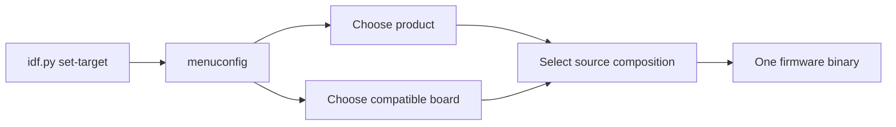

# Variantes de firmware selecionáveis pelo `menuconfig`

**Tipo:** Normativo
**Estado normativo:** Active
**Estado da implementação:** Validated
**Estado do workflow:** Concluída
**Revisão documental:** EKOM 3.2

## Missão

Permitir que um único projeto ESP-IDF produza firmwares de produtos diferentes,
selecionados no SDK Configuration Editor, sem copiar o runtime ISSP e sem
espalhar condicionais de produto pelos componentes compartilhados.

Esta mudança deve usar o experimento como prova prática da EKOM: o mapa e a
árvore de conhecimento precisam fornecer contexto suficiente para orientar a
implementação e a evolução de uma variante sem exigir redescobrir a arquitetura
do repositório.

## Resultado que buscamos

- acelerar a localização dos pontos corretos para criar ou alterar um produto;
- aumentar a qualidade mantendo produto, hardware e plataforma em fronteiras
  explícitas;
- aumentar a confiança de que uma nova variante não altera protocolo,
  commissioning ou outro produto por acidente;
- produzir um binário com uma única composição de produto e placa;
- tornar visível por que cada arquivo existe e qual direção de dependência é
  permitida.

## Pergunta central de contexto

> Para adicionar ou modificar uma variante de produto, onde devo atuar e o que
> devo preservar para não acoplar regras do produto à plataforma compartilhada?

A resposta começa na visão de domínio de `docs/rfc/KNOWLEDGE-MAP.md` e é
completada por esta especificação: escolha em `Kconfig`, composição no product
firmware, detalhes elétricos no board model, capabilities em componentes
reutilizáveis e runtime comum em `SmartSysApp`/`issp_*`.

## Estado atual observado

> Esta seção descreve o baseline anterior à Fase 1, usado pela análise de
> implementabilidade. O estado vigente está nos metadados, nas decisões e nos
> relatórios relacionados ao fim desta especificação.

Antes da Fase 1, `client_154/main/main.cpp` concentrava o entrypoint e a
composição do único produto existente. Ele definia a identidade do dispositivo,
GPIO do relé, GPIO e tempos do factory reset, endpoint e tipo de evento;
registrava uma capability de tomada e iniciava `SmartSysApp`.

`components/issp_app_154` já fornece a fachada compartilhada `SmartSysApp` e
compõe internamente core, behavior, transporte, commissioning, reports e reset.
Os componentes `issp_core`, `issp_transport_154` e `issp_behaviors` já possuíam
fronteiras CMake e contratos públicos. Não existia `Kconfig.projbuild` no
`client_154`, catálogo de boards ou pasta de variantes.

Esse estado forneceu um bom ponto de corte: a mudança extraiu de `main.cpp`
somente a composição específica do produto; não reabriu a arquitetura interna
validada de `SmartSysApp` ou dos componentes ISSP.

## Escopo

- uma seção `IoTSmartLink15.4` no `menuconfig`;
- escolha exclusiva de um product firmware;
- escolha exclusiva de um board model compatível;
- composição em build somente da variante e do board escolhidos;
- entrypoint mínimo, sem regras de produto;
- módulos separados para product firmwares e definições de board;
- uso das operações vigentes e extensão aditiva de `SmartSysApp` somente para
  a capability concreta da Fase 2;
- compatibilidade explícita entre product firmware, board model e
  `IDF_TARGET`;
- primeira migração do produto atual de tomada simples como prova de
  preservação;
- segunda variante `Door sensor` e segundo board ESP32-H2 como prova de
  evolução da composição e da compatibilidade por recursos físicos;
- espaço arquitetural para tomada dupla + luz e sensor de presença, sem
  incluí-los nesta entrega.

### Fase 1 — recorte funcional inicial

A primeira implementação funcional contém somente:

- product firmware `Single smart plug`, selecionado por padrão;
- board model descritivo `Current client ESP32-H2 wiring`, selecionado por
  padrão e compatível exclusivamente com `IDF_TARGET=esp32h2`;
- migração da composição atual para as novas fronteiras, sem alterar a
  plataforma compartilhada.

ESP32-C6 não é target suportado desse board nesta fase. Configurar esse board
com `IDF_TARGET=esp32c6` deve falhar com diagnóstico explícito da
incompatibilidade, antes de produzir um firmware utilizável.

A Fase 1 comprova a seleção, as fronteiras e a preservação do produto atual. Ela
não encerra o experimento de múltiplas variantes: esse encerramento exige uma
segunda composição escolhida pelo Arquiteto e o teste 3 da estratégia EKOM.

### Fase 2 — segunda composição: sensor de porta

A segunda variante é `Door sensor`. A escolha é sustentada por dois fatos do
repositório: o coordenador vigente já interpreta o evento `Door` (`event type
1`) e o histórico do antigo `sensor_154` contém a fiação e o comportamento de
entrada usados como referência. O histórico informa contexto; este recorte é o
contrato vigente.

A Fase 2 contém:

- product firmware `Door sensor`, com device ID `0x15400001`, endpoint 1,
  event type 1, `1 = open`, `0 = closed` e report inicial habilitado;
- board model `Door Sensor Battery H2`, compatível
  somente com `IDF_TARGET=esp32h2`;
- entrada de contato seco no GPIO 14, pull-up interno e estado lógico ativo em
  nível alto, e botão de usuário no GPIO 9, ativo em nível baixo;
- amostragem periódica a cada 10 ms, em janelas não sobrepostas de cinco
  amostras; cada janela é classificada pela maioria de três níveis e o estado é
  confirmado após duas janelas consecutivas com a mesma classificação;
- latência máxima de 150 ms entre a estabilização física da entrada e a
  confirmação da transição pelo behavior; transporte, ACK, retry e observação
  no coordenador não pertencem a esse orçamento;
- report inicial estabilizado e publicado sincronamente por `begin()`, antes de
  iniciar o timer periódico, e um novo report para cada transição estabilizada
  posterior, sem exigir reboot;
- `DigitalInputBehavior` reutilizável em `components/issp_behaviors` e a
  operação pública `SmartSysApp::addDoorSensorCapability()`;
- configuração do sensor contendo pino, polaridade, pull, endpoint, evento,
  report inicial, período de 10 ms e parâmetros de debounce; a variante combina
  os valores do board com suas constantes de produto;
- as mesmas regras de ciclo de vida da fachada vigente: capability adicionada
  antes de `setup()`, par endpoint/evento único entre todas as capabilities e
  falha observável por retorno e `lastConfigurationResult()`;
- ausência de tratamento de comandos pelo sensor de porta: comandos dirigidos
  a esse endpoint/evento são reconhecidos pelo behavior, retornam `Unsupported`
  e não alteram a entrada;
- factory reset pelo botão de usuário, com retenção de 10 segundos e polling de
  20 ms, como no produto vigente;
- seleção e build exclusivos da tomada ou do sensor, nunca dos dois no mesmo
  binário.

O mecanismo de observação usa `esp_timer` periódico dentro do behavior, sem
busy-wait, tarefa ou pilha próprias e sem ativar globalmente
`IDeviceBehavior::poll()`. O product firmware fornece semântica, parâmetros e
composição; o board fornece pino, pull e polaridade elétrica.

O timer usa despacho pela tarefa `esp_timer`, nunca por ISR. O behavior é dono
do handle e deve parar e excluir o timer no destrutor e em qualquer caminho de
falha posterior à sua criação, impedindo callback sobre objeto destruído ou
publicação sem publisher válido.

Bateria, ADC, deep sleep, wake-up por GPIO e métricas de consumo existentes no
histórico não pertencem a esta Fase 2. A retomada desses comportamentos exige
recorte próprio para não confundir a prova de variantes com a reconstrução do
produto de baixo consumo.

## Fora de escopo

- implementar qualquer variante nesta etapa de especificação;
- alterar protocolo wire, transporte, commissioning, ACK, retry, formato ou
  pipeline de reports, NVS ou o comportamento interno do factory reset; a Fase
  2 apenas compõe o serviço vigente com os parâmetros já validados;
- selecionar ou mudar o chip alvo do ESP-IDF pelo `menuconfig`;
- tornar componentes conscientes de produto ou placa;
- carregar duas variantes no mesmo binário ou selecionar produto em runtime;
- criar geração de código, sistema próprio de plugins ou framework genérico de
  boards;
- definir nomes comerciais de placas que ainda não estejam confirmados;
- alterar o coordenador, publicar firmware, fazer deploy ou merge na `main`;
- restaurar bateria, ADC, deep sleep, wake-up por GPIO ou métricas do antigo
  `sensor_154`.

## Conceitos e fronteiras

| Conceito | Responsabilidade | Conhece | Não conhece |
|---|---|---|---|
| Plataforma compartilhada | ciclo de vida da aplicação, ISSP, transporte, commissioning, reports, persistência e reset | contratos técnicos e infraestrutura | modelo comercial, combinação de features ou pinagem de um produto |
| Componente reutilizável | uma capability ou behavior isolado e configurável, como saída ou entrada digital | seu contrato, configuração e abstrações da plataforma | qual produto o usa e qual opção do `menuconfig` o selecionou |
| Product firmware / variant | identidade e composição de capabilities e serviços que definem um produto | APIs públicas, contrato do board e regras do próprio produto | detalhes privados do ISSP, rádio ou outra variante |
| Board model | pinagem, polaridade, recursos físicos e compatibilidade com o chip alvo | propriedades elétricas da placa | protocolo, regras do produto e fluxo do `menuconfig` |
| Seleção de build | escolhe exatamente uma composição válida e informa o CMake | símbolos de variante, board e `IDF_TARGET` | estado em runtime ou lógica interna dos componentes |

`ESP32-H2` e `ESP32-C6` são targets/chips, não nomes suficientes de board
model. Um board model deve representar uma placa concreta e declarar com qual
target é compatível. Até os nomes reais serem confirmados, a implementação deve
usar um identificador descritivo para a fiação atual do client, sem inventar um
nome comercial.

Para a Fase 1, o identificador descritivo representa a fiação vigente do
`client_154` e declara somente ESP32-H2 como target compatível. Suporte futuro
ao ESP32-C6 requer board model próprio ou ampliação explícita da compatibilidade,
acompanhada de validação correspondente.

## Visão do domínio

A árvore do repositório, o diagrama que conecta client e coordenador e o ramo
proposto de variantes estão em `docs/rfc/KNOWLEDGE-MAP.md`. Esse mapa é a porta
de entrada para localizar o client dentro do sistema e navegar por suas
responsabilidades; esta especificação permanece responsável pelo comportamento
da seleção, pelas decisões, restrições e critérios de aceite.

## Fluxo de seleção



O `menuconfig` não muda `IDF_TARGET`. Ele apenas impede ou rejeita combinações
incompatíveis com o target já configurado pelo ESP-IDF.

## Decisões e restrições arquiteturais

1. `Kconfig` escolhe a composição do build; ele não controla lógica interna de
   componentes. Símbolos `CONFIG_*` não devem aparecer em `components/issp_*`.
2. Cada build contém exatamente um product firmware e um board model.
3. O CMake traduz a escolha em um conjunto de fontes. Não se compila todas as
   variantes para decidir em runtime.
4. Condicionais de seleção ficam concentradas em `Kconfig.projbuild` e no
   `CMakeLists.txt` do componente `main`. Não se permite uma árvore de `#ifdef`
   dentro de classes de produto ou componentes.
5. `app_main()` apenas obtém a composição selecionada, inicia a aplicação e
   registra o resultado; identidade, capabilities e regras do produto ficam na
   variante.
6. O product firmware recebe uma definição de board por contrato, sem usar
   números de GPIO próprios. O board não instancia capabilities nem inicia a
   plataforma.
7. Capabilities comuns continuam configuráveis e reutilizáveis. Uma nova
   capability só entra em `components/` quando tiver contrato próprio e utilidade
   além da composição de uma única variante.
8. A migração da tomada simples deve preservar os valores atuais: device ID
   `0x15400001`, relé no GPIO 13 ativo em nível alto, reset no GPIO 9 ativo em
   nível baixo por 10 segundos com polling de 20 ms, endpoint 1, event type 2,
   estado inicial desligado e report inicial habilitado.
9. A compatibilidade board/target deve falhar na configuração ou no build com
   mensagem clara. Não se aceita binário silenciosamente configurado para a
   placa errada. Na Fase 1, o board atual aceita somente ESP32-H2; ESP32-C6 é o
   caso negativo obrigatório.
10. A primeira implementação deve ser pequena. Abstrações adicionais só serão
    criadas quando uma segunda variante demonstrar a necessidade.
11. A forma interna do contrato de seleção não é uma decisão arquitetural
    antecipada. A implementação deve usar o menor mecanismo local que satisfaça
    o entrypoint mínimo e a seleção pelo CMake, sem criar abstração transversal.
12. A partir da segunda variante ou do segundo board, cada product firmware deve
    declarar os recursos físicos de que depende e cada board model deve declarar
    os recursos que oferece. A seleção de build deve rejeitar combinações
    incompatíveis com diagnóstico claro antes de produzir o binário.
13. A forma atual de `BoardModel` é local e provisória para a Fase 1, não um
    contrato estável. Os campos `relayPin`, `relayActiveHigh`,
    `factoryResetButtonPin` e `factoryResetButtonActiveLow` podem ser
    substituídos na Fase 2, quando a segunda variante revelar o vocabulário de
    recursos físicos necessário; não devem ser generalizados antecipadamente.
14. A direção integral foi promovida a `Implementable` pelo Arquiteto antes de
    a segunda variante ser definida, como variável deliberada do experimento.
    O recorte concreto da Fase 2 agora exige nova análise antes da implementação;
    a promoção anterior não substitui esse confronto.
15. Na Fase 2, produto e board são compatíveis por classes e quantidades de
    recursos físicos. `Single smart plug` exige uma saída digital e um botão de
    usuário; `Door sensor` exige uma entrada para contato seco e um botão de
    usuário. O board atual oferece a saída e o botão; o Door Sensor Battery H2
    oferece a entrada e o botão.
16. Cada ramo de seleção no CMake declara uma lista de recursos exigidos pelo
    produto ou oferecidos pelo board. O CMake calcula os recursos ausentes e
    rejeita a composição quando a diferença não é vazia. O diagnóstico deve
    nomear produto, board e recurso ausente. Essa validação pertence à
    composição do build; não autoriza símbolos `CONFIG_*` dentro dos componentes
    nem tenta extrair metadados do código C++.
17. O vocabulário físico de `BoardModel` passa a distinguir saída digital,
    botão de usuário e entrada de contato seco. Campos orientados ao produto,
    como `relayPin`, expiram nesta fase; a representação C++ concreta deve ser
    a menor que expresse esses recursos sem criar um framework genérico.
18. `DigitalInputBehavior` é genérico quanto a produto e evento. Ele estabiliza
    uma entrada, publica estado inicial e transições e reconhece seu par
    endpoint/evento para responder `Unsupported` a comandos. A fachada dá a
    semântica pública de sensor de porta; o behavior não conhece `menuconfig`,
    board ou nome de produto.
19. O protocolo wire e o coordenador não mudam: `event type 1` e os valores
    aberto/fechado já são compreendidos pelo alvo coordenador.
20. O debounce da Fase 2 não reivindica equivalência temporal ao código
    histórico. Preserva a votação por cinco amostras e maioria de três, agora
    com período normativo de 10 ms, janelas não sobrepostas, duas classificações
    consecutivas iguais e latência máxima observável de 150 ms.
21. `DigitalInputBehavior` usa um `esp_timer` periódico para observar a entrada.
    A callback deve ser curta e não bloqueante; não se cria tarefa ou pilha por
    behavior e `IDeviceBehavior::poll()` permanece fora deste recorte.
22. `IsspDevice` passa a garantir segurança entre publicação, reserva e
    conclusão de pending reports com `portMUX_TYPE` interno ou seção crítica
    equivalente. Somente o bookkeeping compartilhado fica protegido; callback,
    notificação, codificação e transporte executam fora da seção crítica. O
    comentário que exige chamadores seriais deve ser atualizado para o novo
    contrato.
23. A preservação de uma variante existente é comportamental. Alterações
    mecânicas necessárias para migrar `single_smart_plug.cpp` ao vocabulário
    físico do board são permitidas, desde que todos os valores da decisão 8 e o
    comportamento observado permaneçam inalterados.
24. `issp_app_154` mantém um registro unificado de behaviors e de pares
    endpoint/evento, independentemente do tipo de capability. `setup()` registra
    esse vetor na ordem de adição e o log de capabilities informa o total de
    capabilities configuradas.
25. `DigitalInputBehavior` pode receber uma fonte de níveis injetável em
    construção reservada a testes, análoga a `SetupHooks`. A configuração
    pública do produto continua usando GPIO real e não expõe essa junção.
26. O CMake permanece como diagnóstico primário de compatibilidade. O contrato
    C++ fornece um acessador por classe de recurso e cada board define somente
    os recursos que oferece, produzindo também falha de ligação se os metadados
    divergirem, sem introduzir geração de código ou framework de boards.
27. O limite de 150 ms termina quando o `DigitalInputBehavior` confirma a
    transição e solicita sua publicação. A chegada ao coordenador é evidência
    funcional separada, sem esse limite, porque inclui fila, transporte, ACK e
    retry.
28. O oráculo normativo do debounce é a sequência de classificações: uma
    oscilação é rejeitada quando não produz duas janelas consecutivas com
    maioria do novo nível. Cinquenta milissegundos são apenas o menor intervalo
    teórico capaz de abranger as seis amostras necessárias em alinhamento
    favorável; não são limiar universal independente da fase de amostragem. Os
    testes controlados devem declarar diretamente os níveis de cada amostra.
29. `begin()` estabiliza e publica o estado inicial de forma síncrona usando o
    mesmo classificador de duas janelas. Somente depois inicia o `esp_timer`
    periódico. A espera inicial pode usar um tick por período de 10 ms com a
    configuração vigente, sem alterar o contrato periódico do timer.
30. `DigitalInputBehavior` é responsável pelo ciclo de vida do `esp_timer`.
    Usa despacho por tarefa, para e exclui o timer no destrutor e desfaz sua
    criação em todo caminho de falha; despacho por ISR não é permitido.
31. A dependência interna de `issp_core` em FreeRTOS é aceita neste recorte. A
    proteção abrange slots, `processingCommand_`,
    `reportNotificationDeferred_`, reserva de sequência e qualquer caminho que
    altere `reportSequence_`, inclusive `publishReport()` enquanto existir.
    Reserva e transição de estado ocorrem atomicamente; codificação, callback,
    notificação e transporte permanecem fora da seção crítica, e falha de
    codificação libera a reserva pelo fluxo normal protegido.

### Registro de conhecimento deste experimento

Por decisão do Arquiteto, este experimento não abre nem atualiza uma transação
`EKM-CHG`. O conhecimento material da implementação deve ser reconciliado de
forma concisa nesta especificação e em `docs/rfc/KNOWLEDGE-MAP.md`; o Git
preserva a linhagem técnica. Essa exceção vale somente para este experimento e
não modifica a governança geral do repositório.

## Experiência proposta no `menuconfig`

```text
IoTSmartLink15.4
├── Product firmware
│   ├── Single smart plug (default)
│   └── Door sensor (Fase 2)
└── Board model
    ├── Current client ESP32-H2 wiring (default)
    └── Door Sensor Battery H2 (Fase 2)
```

Dual smart plug + light e motion sensor permanecem fora do `choice` até
possuírem composição compilável e decisão arquitetural aplicável. O menu não
deve oferecer uma seleção que inevitavelmente falhe por ausência de código.

## Estrutura proposta de arquivos

```text
client_154/
├── CMakeLists.txt
└── main/
    ├── Kconfig.projbuild
    ├── CMakeLists.txt
    ├── app_main.cpp
    ├── product_firmware.hpp
    ├── firmwares/
    │   ├── single_smart_plug.cpp
    │   └── door_sensor.cpp
    └── boards/
        ├── board_model.hpp
        ├── current_client_esp32h2_wiring.cpp
        └── door_sensor_battery_h2.cpp

components/
├── issp_app_154/
├── issp_behaviors/
│   ├── digital_input_behavior.{hpp,cpp}
│   └── test_apps/digital_input_behavior_test/
├── issp_core/
│   └── test_apps/issp_device_concurrency_test/
└── issp_transport_154/
```

Somente arquivos de variantes e boards realmente suportados devem existir. A
árvore mostra o destino do conhecimento e não autoriza criar stubs vazios.

## Pontos reais do código afetados pela Fase 2

| Ponto atual | Mudança esperada na Fase 2 | Preservação obrigatória |
|---|---|---|
| `client_154/main/Kconfig.projbuild` | adicionar as escolhas de sensor e Door Sensor Battery H2 | escolha exclusiva e ausência de lógica funcional |
| `client_154/main/CMakeLists.txt` | selecionar as novas fontes e validar requisitos contra recursos oferecidos | uma variante, um board e diagnóstico antes do binário |
| `client_154/main/firmwares/door_sensor.cpp` | compor identidade, endpoint, evento e debounce do sensor | nenhuma pinagem literal ou lógica de transporte |
| `client_154/main/boards/board_model.hpp` | substituir campos orientados ao relé por recursos físicos | preservar a composição da tomada e evitar framework genérico |
| `client_154/main/boards/door_sensor_battery_h2.cpp` | declarar entrada de contato seco e botão de usuário | nenhuma regra de produto ou protocolo |
| `components/issp_behaviors` | adicionar `DigitalInputBehavior`, dependência explícita de `esp_timer` e ciclo de vida do timer | reutilizável, sem produto, board, `CONFIG_*`, tarefa ou pilha própria |
| `components/issp_app_154` | expor `addDoorSensorCapability()` e unificar o registro interno | não expor tipos privados do ISSP nem mudar as operações vigentes |
| `components/issp_core` | serializar o bookkeeping dos pending reports e assumir dependência interna de FreeRTOS | nenhuma regra de produto; codificação, callbacks, notificações e transporte fora da seção crítica |
| novos `test_apps` de `issp_behaviors` e `issp_core` | provar debounce controlado e integridade concorrente | distinguir comportamento observado de prova de exclusão mútua |
| testes de `issp_app_154` | cobrir adição, registro unificado e regressão | preservar assinatura e ordem do hook vigente |
| `docs/rfc/KNOWLEDGE-MAP.md` | marcar sensor e board como especificados | apontar para este contrato sem duplicá-lo |

## Critérios de aceite

### Seleção e build

- **Dado** um `IDF_TARGET` suportado, **quando** o desenvolvedor abre o SDK
  Configuration Editor, **então** encontra uma seção `IoTSmartLink15.4` com uma
  escolha de product firmware e uma escolha de board model.
- **Dado** o menu de produto com duas ou mais variantes implementadas, **quando**
  uma variante é selecionada a partir da Fase 2, **então** nenhuma segunda
  variante pode permanecer selecionada.
- **Dado** um par produto/board válido, **quando** o projeto é configurado e
  compilado, **então** somente as fontes desse produto e desse board entram no
  binário.
- **Dadas** as combinações `Single smart plug` + board atual e `Door sensor` +
  Door Sensor Battery H2, **quando** cada build H2 é configurado, **então** ambas são
  aceitas e as escolhas default continuam sendo a tomada e o board atual.
- **Dado** o board atual da Fase 1 e `IDF_TARGET=esp32c6`, **quando** a
  configuração ou o build é executado, **então** a combinação é impedida com
  diagnóstico claro de que esse board aceita somente ESP32-H2.
- **Dado** um product firmware cujos recursos exigidos não são oferecidos pelo
  board selecionado, **quando** a configuração ou o build é executado a partir
  da Fase 2, **então** a combinação é impedida com diagnóstico que identifica o
  produto, o board e o recurso ausente.

### Fronteiras

- **Dada** uma nova variante, **quando** ela é adicionada, **então** sua
  composição não altera protocolo nem `issp_transport_154`; `issp_core` muda
  somente para garantir publicação concorrente segura e variantes existentes
  admitem adaptações mecânicas sem mudança de comportamento.
- **Dado** o código compartilhado, **quando** ele é inspecionado, **então** não
  há símbolo `CONFIG_*` de seleção de produto ou board em `components/issp_*`.
- **Dado** um product firmware, **quando** sua composição é inspecionada,
  **então** ele usa o contrato do board e não contém GPIO literal.
- **Dado** o entrypoint, **quando** ele é inspecionado, **então** não contém
  pinagem, identidade, endpoints ou lista de capabilities de um produto.

### Preservação do produto atual

- **Dada** a seleção da tomada simples e do board que representa a fiação
  atual, **quando** o firmware inicia, **então** identidade, relé, reset,
  endpoint, evento, estado inicial e report inicial são configurados com os
  mesmos valores do baseline observado.
- **Dada** a migração estrutural, **quando** os testes e builds vigentes são
  executados, **então** as operações vigentes de `SmartSysApp`, o protocolo e o
  comportamento compartilhado permanecem compatíveis; a API muda somente pela
  adição da capability de sensor de porta.

O primeiro cenário exige validação no hardware ESP32-H2. Comparação estática ou
build isolado não substituem a observação do firmware em execução.

### Sensor de porta

- **Dada** a composição `Door sensor` com o Door Sensor Battery H2, **quando** o
  firmware inicia com a entrada estabilizada em nível alto, **então** publica
  endpoint 1, evento 1 e valor 1 (`open`).
- **Dada** a mesma composição com a entrada estabilizada em nível baixo,
  **quando** o firmware inicia, **então** publica endpoint 1, evento 1 e valor 0
  (`closed`).
- **Dada** a entrada sem convergência nas duas janelas da tentativa síncrona
  inicial, **quando** o firmware inicia, **então** o behavior arma o timer,
  retorna sucesso ao runtime e continua o mesmo classificador; ao obter duas
  classificações consecutivas iguais, publica uma única vez o primeiro estado
  confirmado, sem exigir reboot.
- **Dado** o firmware em execução, **quando** a entrada muda e satisfaz o
  debounce especificado, **então** publica uma vez o novo estado sem reboot e
  o behavior confirma a transição em até 150 ms após a estabilização física; o
  prazo não inclui fila, transporte, ACK, retry ou recepção pelo coordenador.
- **Dada** uma transição confirmada, **quando** seu log é inspecionado, **então**
  ele informa o instante da primeira amostra divergente mantida pelo
  classificador, o instante da confirmação e o limite superior calculado como
  a diferença entre ambos mais um período de amostragem.
- **Dada** uma sequência controlada que não produz duas janelas consecutivas
  com maioria do novo nível, **quando** a entrada volta ao estado anterior,
  **então** nenhum novo report é publicado.
- **Dadas** duas janelas consecutivas com ao menos três amostras do novo nível
  em cada uma, **quando** a segunda janela é classificada, **então** a transição
  é confirmada uma única vez.
- **Dado** um estado já publicado, **quando** novas leituras estabilizam no
  mesmo valor, **então** nenhum report duplicado é criado.
- **Dado** um comando para endpoint 1 e evento 1, **quando** ele chega ao sensor
  de porta, **então** o behavior reconhece o par, devolve `Unsupported`, não
  altera a entrada e não cria report de mudança.
- **Dado** o sensor pareado, **quando** o botão de usuário permanece pressionado
  por 10 segundos, **então** o factory reset remove o pareamento e permite novo
  commissioning após reboot.
- **Dadas** publicação de uma transição e transmissão de reports em contextos
  concorrentes, **quando** pending reports são publicados, reservados e
  concluídos, **então** contagem, ordem, geração e conteúdo permanecem íntegros,
  sem report perdido, duplicado ou slot corrompido.
- **Dada** a seleção da tomada com o board do sensor ou do sensor com o board da
  tomada, **quando** o build é configurado, **então** ele falha antes de gerar
  binário e identifica respectivamente os recursos físicos ausentes.

Os três primeiros cenários exigem validação no hardware ESP32-H2. Debounce,
supressão de duplicatas e rejeição de comandos também devem possuir evidência
automatizada com uma fonte de níveis controlável.

### Navegabilidade EKOM

- **Dados** o mapa de conhecimento e esta especificação, **quando** alguém
  recebe a tarefa de adicionar o sensor de porta, **então** consegue identificar
  onde registrar a seleção, onde compor o produto, onde definir a placa e o que
  não deve alterar.
- **Dada** uma dúvida sobre a localização de uma regra, **quando** se aplica a
  regra de navegação da árvore, **então** ela conduz a uma única fronteira
  principal: seleção, product firmware, board, componente ou plataforma.

## Estratégia de validação do experimento EKOM

O experimento será avaliado durante a primeira implementação, não pelo volume
do documento.

1. **Teste de orientação:** entregar a pergunta “como adicionar o sensor de
   porta?” usando somente o mapa e esta especificação. A resposta deve apontar
   os pontos de extensão e as fronteiras preservadas sem varredura ampla do
   repositório.
2. **Teste de mudança controlada:** migrar primeiro a tomada simples. O diff
   deve permanecer concentrado nos pontos reais listados acima e não alterar a
   plataforma compartilhada.
3. **Teste de segunda composição:** implementar o sensor de porta usando o
   product firmware, o Door Sensor Battery H2, a capability pública e o behavior
   reutilizável definidos nesta Fase 2. Se isso exigir condicionais internas
   nos componentes, alteração do protocolo ou duplicação de runtime, a
   arquitetura ou o mapa deve voltar ao Arquiteto.
4. **Teste de classificação:** avaliar onde seriam colocados “GPIO da placa”,
   “composição de capabilities do sensor” e “retry do rádio”. A árvore deve
   conduzir respectivamente a board model, product firmware e plataforma.
5. **Teste de seleção:** inspecionar os artefatos de build para confirmar uma
   única variante e um único board, além de executar um caso de incompatibilidade
   board/target.
6. **Teste de preservação:** comparar a composição da tomada simples com os
   valores de baseline e executar o conjunto de validação definido abaixo.

### Conjunto de validação da Fase 1

- `git diff --check` e inspeção do diff contra a tabela de pontos afetados;
- configuração gerada contendo exatamente o product firmware e o board default;
- inspeção de `compile_commands.json` ou `build.ninja` comprovando que somente
  as fontes selecionadas entram no build;
- build do `client_154` para ESP32-H2 com ESP-IDF 6.0.1;
- build de `examples/issp_minimal_client` para ESP32-H2;
- preservação da suíte `SmartSysApp`; seus casos permanecem `Not Executed` e
  qualquer execução futura depende de especificação própria;
- build de `coordinator_154` para ESP32-C6;
- configuração ou build negativo do board da Fase 1 com target ESP32-C6,
  usando `SDKCONFIG` isolado fora da configuração H2 rastreada e contendo o
  diagnóstico esperado;
- validação no hardware ESP32-H2 de boot até `Running`, report inicial, comandos
  `ON`, `OFF` e `TOGGLE`, pressão de factory reset por 10 segundos, reboot e
  retorno ao commissioning. Essa execução comprova a preservação da migração e
  não declara resolvida a lacuna preexistente de ACK/retry (`EKM-GAP-0006`).

### Conjunto de validação da Fase 2

- `git diff --check` e inspeção contra os pontos afetados desta fase;
- builds H2 isolados das duas combinações válidas, com inspeção das fontes
  selecionadas;
- configuração negativa das duas combinações cruzadas, sem produção de
  binário e com diagnóstico do recurso ausente;
- caso negativo ESP32-C6 para os dois boards, sempre com `SDKCONFIG` isolado;
- testes automatizados do `DigitalInputBehavior`, com fonte de níveis injetável,
  cobrindo período de 10 ms em caso próprio, sequências explícitas por janela,
  maioria, limite
  de 150 ms na fronteira do behavior, estado inicial síncrono, transição,
  supressão de duplicatas, falha de publicação, destruição com timer ativo e
  comando `Unsupported` reconhecido pelo par;
- testes de concorrência do `IsspDevice` exercitando publicação, reserva e
  conclusão intercaladas e confirmando a integridade dos pending reports; a
  evidência deve distinguir integridade observada da garantia de exclusão
  mútua fornecida pela seção crítica e pela inspeção do código;
- testes da adição de `addDoorSensorCapability()` e regressão integral da suíte
  vigente de `SmartSysApp`;
- build de `examples/issp_minimal_client` e de `coordinator_154`, sem mudança
  funcional nesses consumidores;
- hardware da tomada simples repetindo a preservação da Fase 1;
- hardware do sensor ESP32-H2 comprovando boot até `Running`, report inicial
  aberto e fechado, transições nos dois sentidos sem reboot, ausência de report
  por sequência rejeitada, latência máxima de 150 ms medida até a confirmação
  pelo behavior, factory reset e evento correspondente observado no
  coordenador sem limite de entrega associado ao debounce.
- após a correção de A1, confirmação focada em hardware de que uma entrada
  estável mantém o boot vigente e uma entrada que não converge no orçamento
  inicial não impede `Running`, publicando o primeiro estado quando estabilizar.

Para cada item, falha, execução não iniciada ou resultado desconhecido não
constitui aprovação. A evidência deve permitir distinguir aprovação, reprovação
e ausência de execução.

O experimento é útil se reduzir a redescoberta, tornar os limites previsíveis e
permitir explicar o diff antes de escrevê-lo. Ele falha se o implementador ainda
precisar vasculhar o repositório para descobrir responsabilidades, se duas
fronteiras disputarem a mesma regra ou se o menu apenas esconder um firmware
monolítico cheio de condicionais.

## Variáveis experimentais para encerrar o experimento

- nome e revisão comerciais do board podem substituir o identificador
  descritivo somente após confirmação do Arquiteto;
- a representação C++ concreta dos recursos continua local à implementação,
  limitada pelo vocabulário e pelo mecanismo de compatibilidade das decisões
  15 a 17 e 26;
- o número de slots reservado ao sensor deve ser o mínimo comprovado pelo build,
  sem ampliar preventivamente `kImplStorageBytes`;
- a implementação deve registrar se a extensão aditiva de `SmartSysApp` e a
  compatibilidade por recursos confirmaram as fronteiras ou revelaram contexto
  ainda ausente no mapa.

Essas variáveis são escolhas locais dentro do recorte agora implementável; não
autorizam ampliar protocolo, targets ou produtos. O experimento permanece
aberto até a Fase 2 produzir evidência e o Arquiteto avaliar seu resultado.

## Decisão arquitetural após a revisão da Fase 2

O Arquiteto aceitou a revisão do commit `a6028d3`, declarou a composição Door
sensor + Door Sensor Battery H2 funcional em hardware e determinou que o ciclo
corretivo permaneça nesta especificação. A validação é evidência funcional do
build revisado, sem inferir cenários, medições ou logs que não foram fornecidos.
Ela não encerra os achados nem promove o estado integral.

### Resoluções normativas

32. **A1 — boot com entrada inicialmente instável.** `begin()` mantém a
    tentativa síncrona vigente por duas janelas. Se houver confirmação, publica
    o estado inicial como hoje. Se as classificações divergirem, não retorna
    `Failed`: arma o timer periódico, retorna `Ok` e continua o mesmo
    classificador, preservando a última classificação já observada. O primeiro
    par consecutivo confirmado produz um único report inicial. Falha ao criar ou
    armar o timer continua sendo falha de inicialização; falha ao publicar não
    confirma o estado e pode ser tentada novamente pelo classificador. Um caso
    automatizado próprio deve atravessar classificações iniciais divergentes,
    comprovar que `begin()` retorna `Ok` e observar o primeiro report somente
    depois da convergência.
33. **A2 — instrumentação de latência.** Para uma transição posterior ao estado
    inicial, o behavior registra o instante da primeira amostra que diverge do
    estado confirmado e o mantém enquanto a tentativa de transição não for
    descartada por duas classificações consecutivas do estado anterior. Na
    confirmação, registra também o instante final e o limite superior
    `confirmação − primeira divergência + samplePeriodMs`. A instrumentação não
    altera o protocolo nem inclui fila, transporte, ACK, retry ou coordenador.
34. **A3 — caso próprio de cadência.** O test app acrescenta um caso separado
    que arma o `esp_timer`, registra ao menos dez intervalos consecutivos com
    `esp_timer_get_time()` e verifica média entre 9 ms e 11 ms para a
    configuração nominal de 10 ms. O caso também registra o maior intervalo
    observado para tornar visível o efeito de eventos descartados, mas essa
    observação não redefine o oráculo de debounce.
35. **A7 — leitura concorrente do estado.** O estado público do
    `DigitalInputBehavior` deve usar uma representação atômica coerente para
    `unknown/open/closed`, ou proteção equivalente, de modo que callback e
    leitor não participem de data race. Não se amplia a API pública nem a seção
    crítica de `IsspDevice`.
36. **A8 — força dos oráculos.** Pino inválido e configuração inválida de
    debounce passam a ser casos distintos. O caso vigente de registro é
    renomeado para comprovar somente que duas capabilities do registro
    unificado são registradas. A ordem por tipo permanece evidência estática do
    vetor unificado; não se cria nova junção ou alteração em `SetupHooks` apenas
    para observá-la.
37. **A9 — configuração rastreada.** `client_154/sdkconfig` volta a selecionar
    Single smart plug + Current client ESP32-H2 wiring. Os defaults do `Kconfig`
    permanecem iguais. A seleção usada pelo Arquiteto para validar o Door sensor
    é evidência local e não altera o build autoritativo rastreado.
38. **A4 aceito.** `skip_unhandled_events = true` permanece para evitar rajadas
    de callbacks atrasadas. Cadência real e latência devem tornar o efeito
    observável; não se assume que cada janela sempre ocupa exatamente 50 ms.
39. **A5 e A6 aceitos.** A lacuna de sequência em falha de codificação de
    `publishReport()` é aceita enquanto o método permanecer sem consumidor; um
    consumidor futuro exige novo confronto. Os slots fixos por tipo são aceitos
    enquanto `kImplStorageBytes` não crescer e o `static_assert` permanecer
    válido; não se introduz união, alocação dinâmica ou novo framework neste
    ciclo.

### Recorte da implementação corretiva

A correção limita-se a `DigitalInputBehavior`, seus casos automatizados, aos
casos afetados de `SmartSysApp`, a `client_154/sdkconfig` e à reconciliação
documental. Não autoriza mudança de protocolo, transporte, commissioning,
coordenador, composição de produto, recursos do board ou `SetupHooks`.

O Implementador deve compilar os projetos afetados e registrar evidência, sem
executar suítes, QEMU, flash ou hardware. Depois, uma revisão focada confronta
somente A1, A2, A3, A7, A8 e A9 e confirma que A4, A5 e A6 permaneceram dentro
das limitações aceitas. A execução de casos automatizados continua `Not
Executed` sob TESTEXEC-009. O recorte acrescenta dois casos de
`DigitalInputBehavior` — fallback inicial e cadência — e separa em dois o caso
de validação de `SmartSysApp`; o total preparado esperado passa de 36 para 39.
Após a revisão e a confirmação focada de hardware definida no conjunto de
validação, o Arquiteto decide a conclusão da Fase 2 e do experimento EKOM.

## Relatórios relacionados

- análise: `docs/reports/firmware-variants/analysis/phase-2.md`;
- implementação: `docs/reports/firmware-variants/implementation/phases-1-2-and-corrections.md`;
- revisão: `docs/reports/firmware-variants/review/phase-2.md`;
- validação e confirmação arquitetural: `docs/reports/firmware-variants/validation/architectural-decisions.md`.
